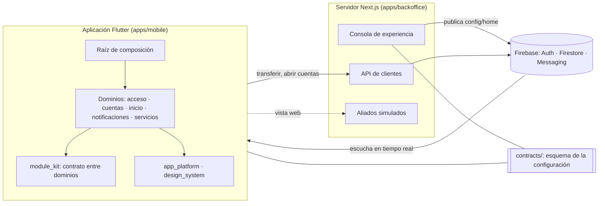

# Banca Digital

Plataforma financiera digital sin atención física. Una aplicación móvil en Flutter cuyo inicio se compone en tiempo de ejecución a partir de una configuración publicada, una consola web que publica esa configuración sin lanzar una versión nueva de la aplicación, y una API de servidor que mueve el dinero.

Este repositorio es la solución a la prueba técnica de Front-End Senior. Los datos son de demostración: no se ejecutan operaciones bancarias reales y los saldos de apertura no tienen valor.

- **Sitio de entrega:** el punto de entrada para quien evalúa, con los pasos para probar la demostración, capturas, flujos y la guía de la consola. Su código está en `apps/showroom/`. Está publicado en <https://flutter-challenge-bi.web.app>.
- **Qué se pidió y qué hay, requisito por requisito:** [docs/alcance-y-riesgos.md](docs/alcance-y-riesgos.md)
- **Decisiones de arquitectura (19):** [docs/adr/](docs/adr/)
- **Guion de la demostración:** [docs/demo/guion.md](docs/demo/guion.md)
- **Uso de IA durante el desarrollo:** [docs/ia/registro-uso-ia.md](docs/ia/registro-uso-ia.md)

## Arquitectura en una pantalla



- **Un paquete por dominio.** Ningún dominio depende de otro; el compilador y una prueba de frontera por paquete lo impiden. Se encuentran en `module_kit` y en la raíz de composición ([ADR 0001](docs/adr/0001-monorepo-workspaces-paquetes-por-dominio.md)).
- **Inicio dirigido por configuración.** La consola publica qué módulos ve cada segmento y en qué orden; cada dominio registra los suyos; un tipo desconocido se omite ([ADR 0013](docs/adr/0013-registro-de-modulos-y-motor-del-inicio.md)).
- **El dinero se mueve en el servidor**, en una transacción, con el identificador de la orden como clave de idempotencia ([ADR 0016](docs/adr/0016-movimiento-de-dinero-en-el-servidor.md)).
- **Un Bloc por conjunto de datos y una única política de resiliencia**: un servicio caído no tumba la pantalla ([ADR 0009](docs/adr/0009-politica-de-resiliencia.md)).

Diagramas: [componentes y dependencias](docs/arquitectura/componentes.md), [flujos principales](docs/arquitectura/flujos.md), [de la consola al teléfono](docs/arquitectura/publicar-configuracion.md).

## Estado

| Requisito del reto | Estado | Detalle |
| --- | --- | --- |
| Onboarding y autenticación | Cumplido | Biometría y correo de recuperación sin verificar en dispositivo |
| Cuentas, saldos y movimientos | Cumplido | Transferencias solo entre cuentas propias |
| Personalización dinámica | Cumplido | Por segmento e interruptores |
| Servicio o micro aplicativo externo | Cumplido | Los dos aliados son simulados |
| Notificaciones push | Cumplido en Android | iOS sin construir |
| Monitoreo en producción | Explicado | Eventos y trazas emitidos; su llegada a la consola de Firebase no se comprobó |
| Conectividad degradada, descrita y demostrada | Cumplido | Vista en un teléfono, con lo no visto señalado |
| Pruebas unitarias, de widgets y E2E | Cumplido, E2E parcial | La versión repetible del E2E no tiene una ejecución válida |
| Documentación del uso de IA | Cumplido | |
| Trunk Based Development | Cumplido | |

La tabla completa, con dónde está cada cosa y cómo se comprobó, está en [docs/alcance-y-riesgos.md](docs/alcance-y-riesgos.md). El servidor está desplegado como demostración (ver [Demostración publicada](#demostración-publicada)); la aplicación no está publicada en ninguna tienda, e iOS no se compiló.

## Requisitos

- **Flutter 3.38.3** (Dart 3.10.1). La versión está fijada en `.fvmrc`; con [FVM](https://fvm.app), `fvm use`.
- **Android SDK** con un teléfono o un emulador (API 24 o superior) y `adb`.
- **Node 22 o superior** (la CI usa 24) y **Java 21 o superior**, para el servidor, los emuladores de Firebase y las pruebas de reglas. Para ejecutar `npm test` directamente en `firebase/`, ese Java debe ser el primero del `PATH` (o el de `JAVA_HOME`); `tool/local-stack.sh`, `tool/verify.sh` y el hook buscan además un JDK instalado con Homebrew.
- Git y Bash.
- Solo para trabajar contra el proyecto real de Firebase: la [CLI de gcloud](https://cloud.google.com/sdk/docs/install) con una cuenta que tenga acceso.

## Configuración

```bash
git clone https://github.com/hveitia/flutter_senior_dev_challenge_bi.git
cd flutter_senior_dev_challenge_bi
tool/setup.sh
(cd apps/backoffice && npm ci)   # dependencias del servidor; las necesita tool/verify.sh
```

`tool/setup.sh` activa los hooks de Git de `.githooks/` y resuelve las dependencias del workspace de Dart. Las del servidor se instalan aparte, con `npm ci`.

## Ejecutar todo en local

Es la forma recomendada de evaluar el proyecto: no necesita acceso al proyecto de Firebase ni credenciales de ningún tipo. Todo corre en tu equipo, sobre los emuladores de Auth y Firestore.

```bash
tool/local-stack.sh up      # emuladores y servidor (consola, API y aliados) en el puerto 3210
tool/local-stack.sh seed    # configuración publicada, un administrador y un cliente con cuentas
```

Además de los puertos 9099 (Auth), 8080 (Firestore) y 3210 (servidor), los emuladores abren su interfaz en <http://localhost:4000> y usan los puertos 4400, 4500 y 9150.

`seed` imprime las dos identidades. Son ficticias, existen solo en tus emuladores y están en `firebase/seed/local-identities.mjs`:

| Quién | Correo | Contraseña | Dónde entra |
| --- | --- | --- | --- |
| Administrador | `admin@banca-digital.test` | `Consola#Local1` | Consola: <http://localhost:3210> |
| Cliente | `cliente@banca-digital.test` | `Cliente#Local1` | Aplicación |

La aplicación, en un teléfono o en un emulador de Android:

```bash
adb reverse tcp:9099 tcp:9099   # Auth
adb reverse tcp:8080 tcp:8080   # Firestore
adb reverse tcp:3210 tcp:3210   # servidor

cd apps/mobile
flutter run --dart-define=USE_FIREBASE_EMULATORS=true \
  --dart-define=ALLOW_FAULT_INJECTION=true \
  --dart-define=PARTNER_BASE_URL=http://localhost:3210 \
  --dart-define=PARTNER_DEV_ORIGIN=true
```

Perfil > Diagnóstico muestra «Entorno: Emuladores locales». También puedes registrar un cliente nuevo desde la aplicación: recibe sus cuentas del servidor.

```bash
tool/local-stack.sh status
tool/local-stack.sh down    # los emuladores olvidan sus datos al detenerse
```

Qué significa cada opción de compilación:

| Opción | Efecto | Candado |
| --- | --- | --- |
| `USE_FIREBASE_EMULATORS=true` | Auth y Firestore apuntan a los emuladores (`FIREBASE_EMULATOR_HOST`, por defecto `localhost`; puertos 9099 y 8080) | Una compilación de publicación se niega a arrancar con ella |
| `ALLOW_FAULT_INJECTION=true` | La aplicación aplica la latencia y las caídas publicadas en el laboratorio de resiliencia | Sin ella se ignoran, aunque estén publicadas |
| `PARTNER_BASE_URL`, `PARTNER_DEV_ORIGIN=true` | Origen de las mini aplicaciones de aliados; `http` solo en desarrollo y hacia el propio equipo | Sin origen, la aplicación no ofrece ninguna |
| `API_BASE_URL` | Dirección de la API de clientes; por defecto `http://localhost:3210/` en depuración y perfil | Una compilación de publicación exige `https` |

**Qué se comprobó de este modo y qué no.** Partiendo de un directorio de usuario vacío (sin gcloud, sin sesión de Firebase y sin credenciales por defecto) se comprobó: emuladores y servidor en marcha, la carga de datos dos veces seguidas, inicio de sesión en el emulador de Auth, una transferencia, su repetición y un sobregiro por la API, el aviso de la transferencia en la bandeja, la sesión de la consola y la consola cargada, un envío de notificación validado y las páginas de los aliados; y `flutter build apk --debug` con las opciones. **No se ejecutó la aplicación en un dispositivo en este modo**: en un teléfono solo se probó contra el proyecto real. En particular, queda sin ver que Firestore vuelva a apuntar al emulador después de cerrar sesión, y publicar desde la consola local se comprobó solo hasta cargarla con sesión.

Diferencias con el proyecto real: las notificaciones no salen del equipo (quedan «Validado») y el servidor corre en modo de desarrollo.

## Demostración publicada

El servidor (consola de experiencia, API de clientes y páginas de los aliados) está desplegado en Firebase App Hosting:

<https://backoffice--flutter-challenge-bi.us-east4.hosted.app>

- La consola pide una cuenta de administrador, que se entrega por privado. Sin ella, la dirección muestra el inicio de sesión; `/api/health` responde sin sesión.
- Para usar la aplicación contra ese servidor no hace falta levantar nada. Se compila apuntando a él:

  ```bash
  cd apps/mobile
  flutter build apk --release \
    --dart-define=API_BASE_URL=https://backoffice--flutter-challenge-bi.us-east4.hosted.app/ \
    --dart-define=PARTNER_BASE_URL=https://backoffice--flutter-challenge-bi.us-east4.hosted.app \
    --dart-define=ALLOW_FAULT_INJECTION=true
  ```

  Cualquiera puede registrarse en la aplicación: el alta crea dos cuentas con un depósito de demostración, sin valor real. Lo que se publique en la consola llega a la aplicación sin reinstalarla.
- Qué se comprobó en el servidor publicado y qué no: [docs/operacion/backoffice.md](docs/operacion/backoffice.md#despliegue-en-firebase-app-hosting).

## Ejecutar contra el proyecto real

La aplicación apunta por defecto al proyecto de Firebase `flutter-challenge-bi`. Sin acceso a ese proyecto puedes registrarte, iniciar sesión y leer tus datos, pero no arrancar el servidor en tu equipo. Las transferencias, el alta de cuentas y la consola las da entonces el servidor desplegado (ver [Demostración publicada](#demostración-publicada)) o el modo local.

Con acceso al proyecto:

```bash
gcloud auth application-default login
gcloud auth application-default set-quota-project flutter-challenge-bi

cd apps/backoffice
npm ci && npm run build
npx next start -p 3210          # con las variables de docs/operacion/backoffice.md
adb reverse tcp:3210 tcp:3210

cd ../mobile
flutter run --dart-define=ALLOW_FAULT_INJECTION=true \
  --dart-define=PARTNER_BASE_URL=http://localhost:3210 \
  --dart-define=PARTNER_DEV_ORIGIN=true
```

- Variables del servidor, alta de administradores y notificaciones reales (`PUSH_DELIVERY=live`): [docs/operacion/backoffice.md](docs/operacion/backoffice.md).
- Contrato de la API: [docs/operacion/api.md](docs/operacion/api.md).
- Herramientas de desarrollo, con las credenciales de gcloud del desarrollador y un candado que rechaza otro proyecto:

  ```bash
  cd firebase
  npm run seed -- --email <correo del cliente> [--segment wealth]          # cuentas y movimientos
  npm run publish-config -- --bump [--latency-ms 5000] [--movements-unavailable]
  ```

Los archivos `firebase_options.dart`, `google-services.json` y `GoogleService-Info.plist` son identificadores de cliente, no secretos, y por eso están versionados.

### Otras formas de ejecutar

```bash
cd apps/mobile
flutter run -t lib/main_gallery.dart    # el sistema de diseño completo, sin ningún servicio
```

Para instalar una compilación de demostración sin depender del modo de depuración: `flutter build apk --profile` con las mismas opciones y `adb install -r build/app/outputs/flutter-apk/app-profile.apk`.

## Pruebas

```bash
tool/verify.sh
```

Comprueba el formato, el análisis estático, que no quede ninguna prueba enfocada o saltada sin motivo, las pruebas de los nueve paquetes de Dart y la consola (lint, compilación, tipos y pruebas). Necesita `npm ci` en `apps/backoffice`; si falta, falla en lugar de omitir la consola. La integración continua ejecuta lo mismo en cada push, en dos flujos (`.github/workflows/ci.yml` y `backoffice.yml`).

| Suite | Pruebas | Qué cubre | Cómo se ejecuta sola |
| --- | --- | --- | --- |
| `packages/design_system` | 359 | Tokens contra `tokens.json`, contraste WCAG de cada combinación permitida, formato de importes, estados y semántica de cada componente, texto al 130 % | `flutter test` en la carpeta |
| `packages/app_platform` | 208 | Lectura tolerante de la configuración, esquema, orígenes de respaldo, política de resiliencia con reloj simulado, conectividad, telemetría sin datos del cliente | ídem |
| `packages/feature_auth` | 286 | Cédula y demás validadores, sesión y sus carreras, registro, inicio de sesión, cuenta a medio crear, pantallas | ídem |
| `packages/feature_accounts` | 444 | Cuentas y movimientos (origen, antigüedad, paginación), tendencia del saldo, transferencias (idempotencia, cola, resultados), pantallas en cada estado | ídem |
| `packages/module_kit` | 19 | Registro de módulos, lectura de propiedades, aviso de estado, frontera del contrato | ídem |
| `packages/feature_home` | 63 | Composición por segmento, tipos desconocidos, falla parcial frente a falla total, actualización | ídem |
| `packages/feature_notifications` | 129 | Invitación al permiso, registro y olvido del dispositivo, teléfono compartido, bandeja, aviso tocado sin sesión | ídem |
| `packages/feature_services` | 189 | Regla de origen, contrato de mensajes, contenedor (cargas reemplazadas, tiempo límite, caídas), borrado de datos, «Para ti» | ídem |
| `apps/mobile` | 169 | Navegación por sesión, composición real con dependencias simuladas, orden del cierre de sesión, destinos, entorno y direcciones permitidas | ídem |
| Servidor y consola | 615 | Edición y publicación con control de versión, sesión de administradores, API de clientes y liquidación, notificaciones, aliados | `npm run verify` en `apps/backoffice` |
| Sitio de entrega | 9 | Enlaces, anclas e imágenes que resuelven, texto alternativo, avisos y `noindex` en cada página, y que no haya direcciones de correo ni contraseñas | `node --test apps/showroom/test/site.test.mjs` |
| Reglas de Firestore | 110 | Qué puede leer y escribir cada quien, caso permitido y casos denegados, contra el emulador | `npm ci` y `npm test` en `firebase` (Node, y Java 21 o superior el primero del `PATH`) |
| Herramientas de carga | 31 | Saldos que cuadran con sus movimientos, documento publicado, identidades locales | `npm run test:seed` en `firebase` |

En total, 1866 pruebas de Dart. No hay pruebas de imagen: las fuentes se dibujan distinto en macOS y en el Linux de la CI ([ADR 0007](docs/adr/0007-sistema-de-diseno.md)).

### Prueba de extremo a extremo

`apps/mobile/integration_test/transfer_flow_test.dart` maneja la aplicación real en un dispositivo, sin dobles: inicia sesión, transfiere un dólar de ahorros a corriente, comprueba que el movimiento lleva la referencia que devolvió el servidor y lo devuelve con una segunda orden, para dejar los saldos como estaban. No corre en la CI. Necesita un teléfono Android conectado o un emulador en marcha; `flutter devices` da el identificador que va en `<dispositivo>`.

```bash
cd apps/mobile
# Contra el modo local (con tool/local-stack.sh up y seed, y los tres adb reverse):
flutter test integration_test/transfer_flow_test.dart -d <dispositivo> \
  --dart-define=USE_FIREBASE_EMULATORS=true \
  --dart-define=E2E_EMAIL=cliente@banca-digital.test \
  --dart-define=E2E_PASSWORD='Cliente#Local1'

# Contra el proyecto real, con un cliente de prueba propio que no se guarda en el repositorio:
flutter test integration_test/transfer_flow_test.dart -d <dispositivo> \
  --dart-define=E2E_EMAIL=<correo> --dart-define=E2E_PASSWORD=<contraseña>
```

Estado, sin adornos: la primera versión, de un solo sentido, pasó en un teléfono contra el proyecto real. La versión actual de ida y vuelta **no tiene todavía una ejecución válida** (el único intento coincidió con el teléfono bloqueado), y no se ha ejecutado contra el modo local.

## Cómo colaborar

El repositorio sigue Trunk Based Development ([ADR 0006](docs/adr/0006-trunk-based-development.md)).

- Una única rama de larga vida, `main`, que siempre debe poder publicarse. Historial lineal, sin commits de fusión.
- Cambios pequeños y frecuentes; cada commit compila y pasa sus pruebas. Mensajes en inglés con [Conventional Commits](https://www.conventionalcommits.org).
- La regla es escribir la prueba antes que el código que verifica. En este reto se cumplió de forma estricta en las correcciones, donde cada defecto se reprodujo primero con una prueba que fallaba; en la primera versión de varias etapas las pruebas se escribieron junto con el código ([docs/alcance-y-riesgos.md](docs/alcance-y-riesgos.md)).
- El trabajo incompleto se integra apagado mediante la configuración publicada, no en ramas largas.
- El hook `pre-commit` ejecuta `tool/verify.sh --affected`: formato y análisis de todo, y las pruebas de lo que el commit toca y de lo que depende de ello. Imprime qué eligió y por qué.
  - Un cambio en la configuración común (`pubspec` de la raíz, `analysis_options.yaml`, `tool/`, `.githooks/`) lo ejecuta todo; uno en `contracts/`, la plataforma y la consola; uno en `apps/backoffice/`, la consola; uno en `firebase/`, las reglas y las herramientas; uno solo de documentación, nada.
  - Rechaza el commit si hay cambios sin preparar o archivos sin seguimiento en `apps/`, `packages/`, `contracts/`, `firebase/` o `tool/`: lo que se verifica tiene que ser lo que se confirma. Lo que no entra se guarda antes con `git stash`.
- La puerta completa es la integración continua, que lo ejecuta todo en cada push. Si `main` se rompe, repararlo o revertir es la prioridad.
- En un equipo, el mismo flujo con ramas de menos de un día integradas por pull request con la verificación en verde. El trabajo en paralelo sobre partes que no se tocan se hace en copias de trabajo (`git worktree`) y se integra en orden.

## Mapa del repositorio

```
apps/
  mobile/                 Aplicación Flutter. Raíz de composición: rutas, dependencias y tema.
  backoffice/             Servidor Next.js: consola de experiencia, API de clientes (app/api)
                          y páginas de los aliados simulados (app/partners).
  showroom/               Sitio de entrega: páginas estáticas en public/ y su comprobación en test/.
packages/
  design_system/          Tokens, tema y componentes. Referencia en tokens/tokens.json.
  app_platform/           Configuración publicada, resiliencia, conectividad y telemetría.
  module_kit/             Contrato entre los dominios y el inicio: registro de módulos, anfitrión, destinos.
  feature_auth/           Registro, inicio de sesión, sesión, biometría y personalización.
  feature_accounts/       Cuentas, movimientos, tendencia, transferencias y cola sin conexión.
  feature_home/           Motor del inicio: lo arma desde la configuración publicada.
  feature_notifications/  Notificaciones push y bandeja.
  feature_services/       Catálogo, contenedor de mini aplicaciones de aliados y «Para ti».
contracts/                Esquema y ejemplo de la configuración. Fuente única para aplicación y consola.
firebase/                 Reglas e índices de Firestore con sus pruebas.
  seed/                   Herramientas de carga: modo local (local.mjs) y proyecto real.
docs/                     Alcance y riesgos, decisiones, diagramas, operación, guion y registro de IA.
tool/                     setup.sh, verify.sh y local-stack.sh.
.githooks/                Hooks de Git versionados.
.github/workflows/        Integración continua (workspace y consola).
```

## Seguridad

- **Qué puede escribir un cliente.** Su perfil, con una lista cerrada de campos validados; una orden de transferencia pendiente, con forma e importe acotados; sus dispositivos; y la marca de leído de su bandeja. Nada más: saldos, movimientos y configuración solo los escribe el servidor. Las reglas niegan todo por defecto y tienen 110 pruebas ([`firebase/firestore.rules`](firebase/firestore.rules)).
- **Dinero.** Una transacción por orden, idempotente por su identificador; una orden que pudo salir del teléfono nunca se encola ([ADR 0016](docs/adr/0016-movimiento-de-dinero-en-el-servidor.md), [0017](docs/adr/0017-transferencias-en-la-aplicacion.md)).
- **Datos personales.** Cédula, nombre, correo, celular, importes y números de cuenta no van a la telemetría. Al terminar una sesión se borra lo que el dispositivo guardó, y un borrado que no termina queda pendiente y se completa antes de la siguiente.
- **Consola.** Solo administradores de una lista, con correo verificado y una cookie que solo lee el servidor ([ADR 0015](docs/adr/0015-acceso-de-administradores.md)). Un token de cliente no abre la consola.
- **Candados de compilación.** Una versión de publicación no arranca con emuladores, sin `https` para la API o con `http` para los aliados. Los fallos simulados del laboratorio de resiliencia se ignoran en cualquier compilación hecha sin `ALLOW_FAULT_INJECTION`. La compilación de la demostración se hace con esa opción a propósito, para que el laboratorio pueda usarse; una destinada a producción se haría sin ella.
- **Claves en el repositorio.** Los archivos de configuración de Firebase contienen identificadores de cliente. Ninguna clave de cuenta de servicio ni archivo `.env` se versiona. Las claves están limitadas a las API de Firebase; no por aplicación, a propósito, para que quien compile desde el código no quede bloqueado.

## Límites conocidos

- **iOS** no se compiló ni se probó.
- **El servidor está desplegado solo como demostración** y la aplicación no está en ninguna tienda: se instala desde el código o desde un APK firmado con la clave de depuración de la plantilla. Falta la firma de publicación.
- **El registro es abierto** y cada cliente nuevo recibe un depósito de demostración. Faltan verificación de correo, App Check y límites de frecuencia.
- **Los aliados son simulados** y comparten servidor con la consola.
- **Sin verificar en un dispositivo:** desbloqueo biométrico, texto oculto en la pantalla de bloqueo, sesión revocada, borrado de lo que guarda la vista web y el modo local completo.
- **La llegada de la telemetría a la consola de Firebase no se comprobó** y no hay alertas configuradas.
- **Sin tema oscuro ni traducciones.**

La lista razonada, con supuestos, riesgos y la estrategia de escalamiento, está en [docs/alcance-y-riesgos.md](docs/alcance-y-riesgos.md); lo que falta para producción, en [docs/operacion/despliegue.md](docs/operacion/despliegue.md). El despliegue del servidor en Firebase App Hosting, con lo que se comprobó en él y lo que no, está en [docs/operacion/backoffice.md](docs/operacion/backoffice.md#despliegue-en-firebase-app-hosting).

## Documentación

- [Índice](docs/README.md)
- [Alcance, supuestos, riesgos y escalamiento](docs/alcance-y-riesgos.md)
- [Decisiones de arquitectura](docs/adr/) · [Diagramas](docs/arquitectura/)
- [Despliegue y operación](docs/operacion/despliegue.md) · [Monitoreo](docs/operacion/monitoreo.md) · [Conectividad degradada](docs/operacion/conectividad-degradada.md)
- [Guion de la demostración](docs/demo/guion.md)
- [Registro de uso de IA](docs/ia/registro-uso-ia.md)
