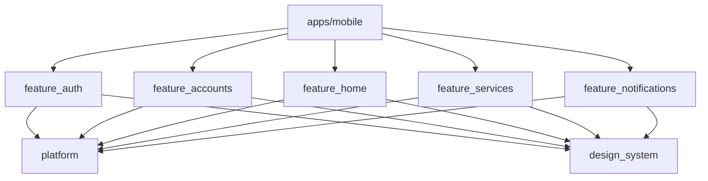

# 0001. Monorepo con workspaces y paquetes por dominio

- **Estado:** Aceptada
- **Fecha:** 2026-10-03
- **Implementación:** existe el workspace raíz con `apps/mobile` y el análisis estático compartido. Los paquetes de dominio y la consola web están planificados y se crean en sus etapas.

## Problema a resolver

La solución debe poder evolucionar hacia un ecosistema de varios dominios funcionales administrados por equipos independientes. Hace falta una estructura donde los límites entre dominios sean reales y comprobables, y donde la aplicación móvil, la consola web y el contrato que comparten evolucionen de forma coordinada.

## Alternativas evaluadas

1. **Una sola aplicación con carpetas por funcionalidad.** Es lo más rápido de arrancar. El límite entre dominios es solo una convención: nada impide que un dominio importe código interno de otro.
2. **Monorepo con un paquete Dart por dominio, usando los workspaces nativos de `pub`.** El compilador y el análisis estático hacen cumplir los límites, con una única resolución de dependencias. Añade un `pubspec.yaml` por paquete.
3. **Monorepo con paquetes gestionados por Melos.** Mismos límites que la opción anterior, más comandos de orquestación. Añade una herramienta externa para algo que el SDK ya resuelve.
4. **Un repositorio por dominio.** Máxima autonomía de equipos. Exige versionar y publicar paquetes, y un cambio transversal requiere varios pull requests coordinados.

## Opción seleccionada

La opción 2: monorepo con workspaces nativos de `pub` y un paquete por dominio.

Estructura prevista:

```
apps/
  mobile/                  Raíz de composición: rutas, inyección, tema
  backoffice/              Consola web y API de servidor (Next.js)
packages/
  design_system/           Tokens y componentes
  platform/                Configuración remota, resiliencia, sesión, observabilidad
  feature_auth/
  feature_accounts/        Cuentas, movimientos, transferencia
  feature_home/            Motor del inicio dirigido por configuración
  feature_services/        Catálogo y contenedor de micro aplicativos
  feature_notifications/
contracts/                 Esquema de la configuración del inicio
firebase/                  Reglas, índices y datos semilla
docs/
```

Dirección de dependencias prevista:



Ningún paquete de dominio depende de otro. La aplicación es el único lugar que los conoce a todos.

Dentro de cada paquete de dominio se usan tres capas: datos, dominio y presentación. Los casos de uso se crean solo cuando contienen lógica real; una llamada que únicamente delega en un repositorio no justifica una clase propia.

**Análisis estático.** Todo el workspace comparte `analysis_options.yaml`, basado en `very_good_analysis` con `strict-casts`, `strict-inference` y `strict-raw-types`. Se evaluó `flutter_lints`, que es el conjunto por defecto, pero es deliberadamente permisivo. Se eligió un conjunto estricto y conocido para que las reglas no sean una discusión de equipo y los defectos de tipos se detecten antes de ejecutar. La regla `public_member_api_docs` está desactivada porque son paquetes internos de una aplicación, no una API publicada.

## Trade-offs

- **Se gana:** límites entre dominios comprobados por el compilador, cambios transversales atómicos en un solo commit, y una única versión de cada dependencia en todo el sistema.
- **Se paga:** más archivos de configuración, y todos los paquetes comparten la misma resolución de dependencias, de modo que un equipo no puede adelantarse a otro en la versión de una librería.
- **Se paga:** la verificación ejecuta todo el workspace en cada cambio. Con el tamaño actual es aceptable; no hay todavía ejecución selectiva por paquete afectado.

## Impacto a largo plazo

Un dominio puede extraerse a su propio repositorio sin reescribirlo, porque ya es un paquete con dependencias explícitas. Sumar un dominio nuevo consiste en crear un paquete y registrarlo en la aplicación.

Convendría revisar la decisión si el tiempo de verificación crece hasta frenar la integración frecuente (entonces se añade ejecución selectiva), o si los equipos necesitan ciclos de versión independientes (entonces se evalúa la opción 4 para esos dominios).
