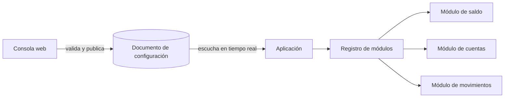

# 0005. Inicio dirigido por configuración con registro de módulos

- **Estado:** Aceptada
- **Fecha:** 2026-10-03
- **Implementación:** construida. El contrato y su lectura llegaron en la etapa 3 ([ADR 0008](0008-contrato-de-configuracion.md)); el registro de módulos y el motor del inicio, en la etapa 6 ([ADR 0013](0013-registro-de-modulos-y-motor-del-inicio.md)). La configuración la publica la consola web, construida en la etapa 7 ([ADR 0014](0014-consola-de-experiencia.md)); una herramienta de desarrollo (`firebase/seed/publish-config.mjs`) hace lo mismo desde la línea de comandos.

## Problema a resolver

La experiencia debe adaptarse al segmento y a las preferencias del usuario, y debe ser posible incorporar experiencias, contenidos o componentes visuales sin publicar una versión completa de la aplicación. A la vez, cada dominio pertenece a un equipo distinto, y el inicio no puede convertirse en un punto donde todos los equipos editan el mismo código.

## Alternativas evaluadas

1. **Solo banderas de funcionalidad.** Simple y de bajo riesgo. Permite encender y apagar, pero no reordenar ni componer la pantalla por segmento.
2. **Interfaz definida por completo desde el servidor (por ejemplo, Remote Flutter Widgets).** Máxima flexibilidad sin publicar. El servidor describe widgets, lo que complica las pruebas, la accesibilidad y la seguridad, y es difícil de dominar y defender en el plazo disponible.
3. **Actualización de código en caliente (por ejemplo, Shorebird).** Permite cambiar cualquier cosa. Es un mecanismo de despliegue, no de personalización, y depende de un servicio externo y de las políticas de las tiendas.
4. **Registro de módulos nativos compuesto por configuración.** La configuración indica qué módulos se muestran, en qué orden y con qué propiedades; cada módulo es un widget nativo aportado por su dominio. Un tipo de módulo nuevo sí requiere publicar la aplicación.

## Opción seleccionada

La opción 4.

- Cada paquete de dominio registra en la aplicación los tipos de módulo que aporta y sus rutas. El motor del inicio no conoce los dominios.
- La configuración se publica como un documento que la aplicación escucha en tiempo real, de modo que un cambio se refleja sin reiniciar. Se prefirió frente a Remote Config, cuyos cambios tardan en propagarse.
- La configuración se organiza por segmento: cada segmento define su lista ordenada de módulos y sus funcionalidades activas. Un segmento nuevo se crea solo con configuración.
- Las acciones solo pueden apuntar a destinos de una lista cerrada, que comparten los banners, las acciones rápidas y las notificaciones.

Reglas del contrato, que la aplicación aplica al interpretar la configuración:

| Situación | Comportamiento |
|---|---|
| Tipo de módulo desconocido | Se omite sin error |
| Campo ausente | Se usa el valor por defecto del módulo |
| Funcionalidad desactivada | Sus puntos de entrada se ocultan |
| Versión de esquema superior a la que la aplicación soporta | Se conserva la última configuración válida |

## Trade-offs

- **Se gana:** composición, orden, contenido y activación cambian sin publicar; los módulos siguen siendo widgets nativos, comprobables y accesibles.
- **Se gana:** un equipo añade un módulo sin tocar el código del inicio.
- **Se paga:** un tipo de módulo nuevo requiere una versión nueva de la aplicación. Lo remoto es la composición, no el código.
- **Se paga:** la aplicación y la consola pueden quedar desfasadas. Por eso el contrato tiene versión y las cuatro reglas anteriores existen.
- **Riesgo:** una configuración errónea publicada afecta a todos los usuarios del segmento. Se mitiga validando en la consola antes de publicar y conservando en la aplicación la última configuración válida.

## Impacto a largo plazo

El contrato se convierte en una interfaz pública entre equipos, y su evolución debe ser compatible hacia atrás mientras existan versiones antiguas de la aplicación instaladas. El mismo mecanismo admite más adelante experimentos por segmento o personalización por usuario sin cambiar el motor.

Convendría revisar la decisión si la necesidad de publicar componentes visuales nuevos sin versión se vuelve frecuente; entonces se evaluaría la opción 2 para un subconjunto acotado de módulos.
