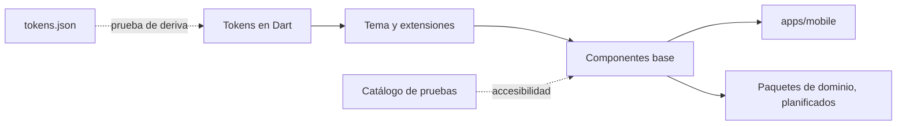

# 0007. Sistema de diseño como paquete, con tokens verificados y accesibilidad comprobada por pruebas

- **Estado:** Aceptada
- **Fecha:** 2026-10-03
- **Implementación:** existe el paquete `packages/design_system` con tokens, tema, diez componentes base y sus pruebas. La aplicación lo usa en la pantalla de inicio de carga y en una galería de revisión. Los componentes con forma de dominio (tarjeta de cuenta, fila de movimiento, banner promocional, navegación inferior) están planificados en sus etapas.

## Problema a resolver

Varios paquetes de dominio, potencialmente de equipos distintos, deben producir pantallas que se vean y se comporten como un solo producto. La accesibilidad y la consistencia son criterios de evaluación, y el color de marca plantea un riesgo concreto: el naranja `#EA8E29` no alcanza el contraste mínimo como color de texto sobre ninguna superficie clara, ni con texto blanco encima.

Además, el diseño se entrega como un archivo de tokens (`tokens.json`) que puede cambiar. Hace falta saber cuándo el código deja de coincidir con él.

## Alternativas evaluadas

**Origen de los tokens en Dart**

1. **Constantes escritas a mano, con una prueba de deriva contra `tokens.json`.** Código legible y sin pasos de generación. Un cambio en la referencia rompe una prueba en lugar de pasar inadvertido. Exige actualizar la constante a mano.
2. **Generador de código a partir de `tokens.json`.** Elimina la actualización manual. Añade una herramienta que mantener y un paso de compilación para unas sesenta constantes que cambian poco.
3. **Constantes sin verificación.** Lo más rápido. La deriva entre diseño y código solo se descubre mirando la pantalla.

**Valores que Material no modela** (colores semánticos, tintes, espaciado, radios)

1. **`ThemeExtension`.** Viajan con el tema, se leen desde el contexto y pueden sustituirse por otro tema.
2. **Constantes estáticas leídas directamente por los componentes.** Más simple, pero ata cada componente a un único tema.

**Garantía de accesibilidad**

1. **Reglas comprobadas por pruebas.** El contraste de cada combinación permitida se calcula en una prueba; cada componente pasa por las guías de accesibilidad de Flutter y por una prueba de desbordamiento con texto al 130 %.
2. **Reglas descritas en la documentación.** No cuesta nada y no impide nada.

**Verificación visual**

1. **Pruebas de widgets sobre estructura, estados y semántica, más una galería para revisión en dispositivo.**
2. **Pruebas golden (comparación de imágenes).** Detectan regresiones visuales, pero el renderizado de fuentes difiere entre macOS, donde se desarrolla, y Linux, donde corre la integración continua. Las imágenes generadas en un sistema fallan en el otro.

## Opción seleccionada

La primera opción en los cuatro casos.

- **`tokens.json` es la referencia.** Las constantes de Dart se escriben a mano y `token_drift_test.dart` falla si un valor difiere, y también si aparece un token nuevo que no esté ni asignado ni declarado fuera de alcance.
- **Tema Material 3 construido desde los tokens**, con dos extensiones: `AppSemanticColors` y `AppMetrics`.
- **`ColorScheme.primary` es el naranja apto para texto (`brand/700`), no el relleno de marca.** Material pinta `primary` como texto en muchos componentes. Con esta asignación todos cumplen AA por construcción. El relleno de marca vive en `primaryContainer`.
- **Los colores de texto son una lista cerrada (`AppTextColors`) que excluye el naranja de marca.** Una prueba recorre el texto pintado por cada componente y falla si alguno lo usa.
- **Los importes son enteros en centavos** y se formatean siempre como `$4,820.35`, sin depender del idioma del dispositivo. La etiqueta para lectores de pantalla es una frase en español, no la cadena visual.
- **Catálogo de componentes en las pruebas.** Cada componente y estado se registra una vez y pasa por las mismas comprobaciones: tamaño de área táctil, áreas táctiles etiquetadas, contraste de texto, desbordamiento en un teléfono pequeño con texto al 130 % y ausencia del naranja de marca en texto.

## Trade-offs

- **Se gana:** las reglas de accesibilidad no dependen de la disciplina de quien escribe la pantalla. Se comprobó pintando temporalmente una etiqueta con el naranja de marca: la prueba de contraste lo rechazó (2,2:1 frente al mínimo de 4,5:1).
- **Se gana:** un cambio del diseño en `tokens.json` se convierte en una prueba en rojo.
- **Se paga:** cada token se mantiene en dos lugares. La prueba de deriva es la mitigación.
- **Se paga:** sin pruebas golden, una regresión puramente visual (un margen, una alineación) no la detecta la integración continua. La mitigación es la galería (`lib/main_gallery.dart`) para revisión en dispositivo. En esta etapa esa revisión detectó un defecto real: el espaciado entre letras por defecto de Material se filtraba en la escala tipográfica.
- **Se paga:** `primary` deja de ser el color de marca, lo que sorprende a quien conoce Material. Está documentado en el código del tema.

Desviaciones conocidas respecto a la referencia de diseño:

- **Iconos.** Se usan los iconos delineados de Material, no un juego con trazo de 1,5 px.
- **Anillo de foco.** Es un borde de 2 px del color indicado, sin la separación de 2 px de la referencia.
- **Botón deshabilitado.** Usa el texto secundario sobre la superficie hundida para seguir siendo legible, en lugar de `ink/300`.

## Impacto a largo plazo

Un equipo nuevo obtiene los componentes y las reglas al depender del paquete, y su pantalla hereda las comprobaciones de accesibilidad al registrar sus componentes en un catálogo equivalente.

**Fuera de alcance de forma consciente:** el tema oscuro. La estructura lo permite (bastan otra instancia de `AppSemanticColors` y otro `ColorScheme`), pero la referencia de diseño solo define el tema claro y cada combinación nueva tendría que superar las mismas pruebas de contraste.

Convendría revisar la decisión si los tokens empiezan a cambiar con frecuencia o los consume más de una plataforma, casos en los que un generador compensa su costo. También si se fija un entorno de renderizado único para la integración continua, lo que haría viables las pruebas golden.
