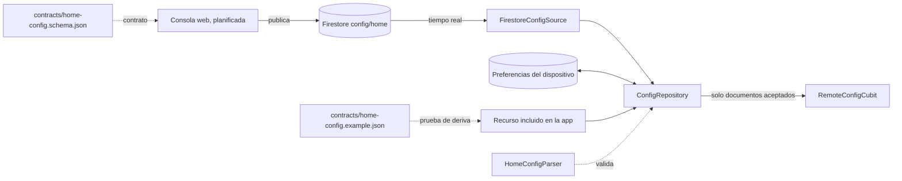

# 0008. Contrato de configuración publicado, con lectura tolerante a versiones

- **Estado:** Aceptada
- **Fecha:** 2026-10-03
- **Implementación:** existen el esquema y el ejemplo en `contracts/`, y en `packages/app_platform` el modelo, el analizador, el repositorio, el `RemoteConfigCubit` y los adaptadores de Firestore, almacenamiento local y recurso incluido. Todo está cubierto por pruebas unitarias. **No está conectado todavía a la aplicación** ni se ha ejecutado contra el Firestore real: el documento `config/home` aún no existe y lo publicará la consola web (etapa 7). El registro de módulos que interpreta cada tipo llega en la etapa 6.

## Problema a resolver

La consola web publica un documento que decide qué muestra el inicio de la aplicación. Lo escribe un equipo y lo leen aplicaciones ya instaladas, que no se actualizan cuando el documento cambia. Hay tres riesgos:

- Un documento mal formado, o con un campo nuevo, deja a la aplicación sin inicio.
- Una versión antigua de la aplicación interpreta mal un documento pensado para una más nueva.
- La aplicación arranca sin red y no tiene ninguna configuración.

El prototipo de diseño validaba solo la versión del esquema y guardaba como «última válida» cualquier documento que la tuviera. Eso no se copia.

## Alternativas evaluadas

**Dónde vive el contrato**

1. **Un esquema JSON y un ejemplo en `contracts/`, en la raíz del monorepo.** Lo leen la aplicación (Dart) y la consola (TypeScript) sin que ninguna dependa del código de la otra.
2. **Tipos compartidos generados para ambos lenguajes.** Elimina la duplicación de modelos, pero añade un generador y un paso de compilación para un documento pequeño.
3. **El modelo de Dart como única definición.** La consola tendría que deducir el contrato leyendo código de otro lenguaje.

**Cómo lee la aplicación**

1. **Lectura tolerante escrita a mano, con un resultado tipado.** Cada regla de tolerancia es una decisión explícita con su prueba.
2. **Deserialización generada (`json_serializable`).** Menos código, pero su comportamiento por defecto ante un tipo inesperado es lanzar una excepción y descartar el documento entero.
3. **Validación estricta contra el esquema en el dispositivo.** Rechaza cualquier documento con un campo desconocido, que es justo el caso que debe funcionar.

**De dónde sale la configuración al arrancar**

1. **Última válida guardada en el dispositivo, y si no existe, una incluida en la aplicación.** Siempre hay configuración, con o sin red.
2. **Esperar a la red.** El primer arranque sin conexión no muestra nada.

## Opción seleccionada

La primera opción en los tres casos.

**Reglas de lectura** (`HomeConfigParser`, una prueba por regla):

| Situación | Resultado |
|---|---|
| Campo desconocido, en cualquier nivel | Se ignora |
| Campo ausente o de tipo incorrecto | Valor por defecto de `ConfigDefaults` |
| Módulo mal formado (sin `id`, sin `type`, `id` repetido) | Se omite ese módulo; el resto se conserva |
| Acción con un destino fuera de la lista `destinations` | Se elimina la acción, esté donde esté dentro de `props` |
| Tipo de módulo que nadie registró | Se conserva; lo omite el registro de módulos (etapa 6) |
| `schemaVersion` superior a la soportada | Documento rechazado; se mantiene la última configuración válida |
| `schemaVersion` ausente o ilegible, documento que no es un objeto, ningún segmento utilizable | Documento rechazado |

Valores por defecto que conviene conocer:

- **Una funcionalidad no declarada queda apagada.** Si falta `features.transfers`, no hay transferencias. Es la opción conservadora para un banco.
- **Un módulo sin `visible` es visible.**
- **La latencia inyectada tiene un tope de 10 segundos**, para que un valor erróneo publicado desde la consola ralentice la aplicación pero no la inutilice.
- **Segmento desconocido:** se usa `starting`; si tampoco existe, el primero por orden alfabético.

El analizador nunca lanza una excepción. Devuelve `ConfigAccepted` o `ConfigRejected` con el motivo, y quien lo llama está obligado a tratar ambos casos.

**Repositorio** (`ConfigRepository`):

- Al arrancar entrega la configuración guardada si sigue siendo válida; si no, la incluida en la aplicación.
- Un documento remoto solo sustituye a la actual si el analizador lo acepta. Entonces se guarda para el siguiente arranque.
- Un documento rechazado, un fallo de la fuente remota o un fallo del almacenamiento nunca dejan a la aplicación sin configuración. Cada caso se informa a la telemetría.
- Cada configuración aplicada deja su versión y su origen (`remote`, `cached`, `bundled`) como contexto de los informes de errores.

**Organización del paquete.** El paquete se llama `app_platform` y no `platform`, porque ese nombre ya existe en pub.dev y lo usan dependencias transitivas. Expone tres puntos de entrada:

- `app_platform.dart`: interfaces y lógica pura, sin Flutter ni Firebase. Es lo que importan los paquetes de dominio.
- `adapters.dart`: implementaciones sobre Firebase y plugins. Solo lo importa la raíz de composición.
- `testing.dart`: dobles de prueba.

Una prueba de arquitectura falla si un archivo fuera de `adapters/` importa Flutter, Firebase o un plugin.

**Dependencias añadidas:** `bloc` (el Cubit es Dart puro), `cloud_firestore` (fuente remota), `shared_preferences` (un único documento sin datos personales; no requiere almacenamiento cifrado) y, para pruebas, `bloc_test`, `mocktail` y `fake_async`.

## Trade-offs

- **Se gana:** un documento parcialmente incorrecto degrada una parte del inicio en lugar de romperlo entero.
- **Se gana:** una aplicación antigua sigue funcionando cuando el contrato evoluciona, con la última configuración que entendió.
- **Se paga:** el modelo existe en dos lenguajes. El esquema y el ejemplo compartidos son la referencia, y una prueba verifica que el recurso incluido coincide con el ejemplo.
- **Se paga:** la tolerancia puede ocultar errores de publicación. Por eso la consola debe validar contra el esquema antes de publicar, y la aplicación informa cada rechazo.
- **Se paga:** la aplicación no valida contra el esquema JSON en el dispositivo; las reglas del analizador y el esquema pueden divergir. La mitigación prevista es validar el ejemplo contra el esquema en las pruebas de la consola.
- **Se paga:** la regla de destinos es estructural: cualquier objeto con un campo `destination` se trata como una acción. Un módulo no puede usar ese nombre para otra cosa.
- **Limitación:** un documento remoto que contenga tipos propios de Firestore (por ejemplo una marca de tiempo) se aplica, pero no puede guardarse en el dispositivo. Queda informado en la telemetría.

## Impacto a largo plazo

Añadir un campo opcional no exige coordinar versiones. Un cambio incompatible sube `schemaVersion`: las aplicaciones antiguas conservan su última configuración válida hasta actualizarse, por lo que la consola necesitará saber qué versiones de la aplicación siguen en uso antes de publicar con un esquema nuevo. Esa comprobación no existe todavía.

Convendría revisar la decisión si el documento crece hasta necesitar carga por partes, o si se requiere publicar configuraciones distintas por versión de la aplicación.
