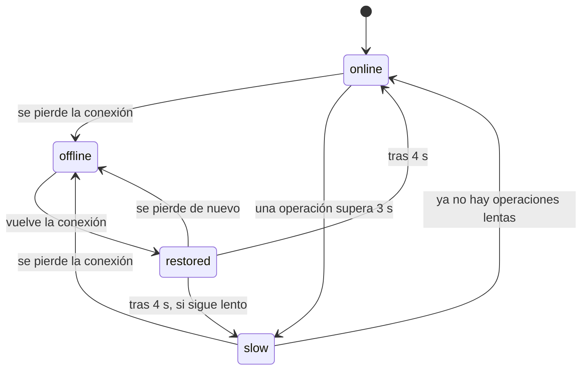

# 0009. Una única política de resiliencia, con inyección de fallos para demostración

- **Estado:** Aceptada
- **Fecha:** 2026-10-03
- **Implementación:** existen en `packages/app_platform` la política (`ResiliencePolicy`), los fallos tipados, el `ConnectivityCubit` y el adaptador de `connectivity_plus`, con pruebas sobre un reloj simulado. La opción de compilación `ALLOW_FAULT_INJECTION` está definida en la aplicación. **Ningún repositorio usa la política todavía**, así que la opción aún no se pasa a ninguna, y nada se ha ejecutado en un dispositivo: los repositorios de cuentas, movimientos y transferencias llegan en las etapas 5 y 8, y los estados visibles (banners, reintento, caché) en la etapa 6.

## Problema a resolver

El enunciado pide describir y demostrar el comportamiento ante conectividad limitada, alta latencia e indisponibilidad parcial, con estados de carga, reintentos, caché y recuperación.

Si cada repositorio decide por su cuenta cuánto esperar, cuántas veces reintentar y cómo informar un fallo, el comportamiento es inconsistente y las pantallas reciben excepciones de plugins que no saben interpretar. Además, para demostrar una caída hay que provocarla, y hacerlo desconectando servicios reales no es repetible.

## Alternativas evaluadas

**Dónde vive la lógica de espera y reintento**

1. **Una política única por la que pasa cada llamada a un servicio.**
2. **En cada repositorio.** Flexible, pero se duplica y diverge.
3. **En un interceptor HTTP.** No cubre Firestore, que no se usa a través de HTTP desde la aplicación.

**Cómo se informa un fallo**

1. **Resultado tipado (`Success` o `Failed` con un `AppFailure`).** El compilador obliga a tratar los cuatro casos.
2. **Excepciones.** Menos código en el camino feliz; es fácil olvidar un caso y lo decide cada pantalla.

**Cómo se simula un fallo en la demostración**

1. **Inyección dentro de la política, leída de la configuración publicada.** La caída simulada recorre el mismo camino de tiempo de espera y reintento que una real.
2. **Repositorios falsos intercambiables.** No ejercita el código real de resiliencia.
3. **Cortar la red del dispositivo.** Demuestra la falta de conexión, pero no la latencia ni la caída de un solo servicio.

## Opción seleccionada

La primera opción en los tres casos.

**Política** (`ResiliencePolicy.run`):

| Aspecto | Valor |
|---|---|
| Tiempo de espera por intento | 8 s, latencia inyectada incluida |
| Intentos | Uno. Hasta 3 solo si quien llama declara la operación idempotente |
| Espera entre intentos | Exponencial desde 400 ms, con variación aleatoria entre la mitad y el total |
| Señal de lentitud | Cuando un intento supera 3 s |
| Se reintenta | Una operación idempotente, ante tiempo de espera agotado o servicio no disponible |
| No se reintenta | Sin conexión (se muestra la caché) y error inesperado (es un defecto) |

- **Los reintentos se piden, no se heredan.** `run` exige el parámetro `idempotent`. Con `false`, la operación se ejecuta exactamente una vez, falle como falle. La razón: un intento que agota su tiempo se abandona en el dispositivo, pero la petición que ya salió puede completarse en el servidor. Reintentar a ciegas una transferencia podría mover el dinero dos veces. Una operación que cambia datos pasa `false`, o envía una clave de idempotencia que permita al servidor reconocer la repetición (etapa 8).
- `onRetry` recibe el número del intento que empieza, para que la pantalla muestre «Intento 2 de 3».
- La política emite tres eventos, solo con el servicio y el número de intento: `resilience_timeout`, `resilience_retry` y `resilience_attempts_exhausted`.
- Los temporizadores del tiempo de espera y de la señal de lentitud se cancelan en cuanto termina el intento.
- `slowChanges` publica cuándo hay operaciones lentas en curso y cuándo dejan de haberlas.
- El tiempo y la aleatoriedad se inyectan. Las pruebas corren sobre un reloj simulado y no esperan tiempo real.

**Fallos tipados:** `OfflineFailure`, `TimeoutFailure`, `ServiceUnavailableFailure` y `UnexpectedFailure`.

**Conectividad** (`ConnectivityCubit`): un único estado para toda la aplicación, pensado para el banner del sistema de diseño.

**Inyección de fallos.** El bloque `resilience` de la configuración (`latencyMs`, `movementsUnavailable`, `partnerInsuranceUnavailable`) solo tiene efecto dentro de la política:

- La latencia se añade antes de cada intento y cuenta contra el tiempo de espera.
- Un servicio marcado como no disponible responde con `ServiceUnavailableFailure` en cada intento, sin llamar al servicio real.
- Los ajustes se leen en cada intento, así un cambio publicado desde la consola se aplica a mitad de una operación.

Es una capacidad de demostración y tiene candado en la aplicación:

- **La política ignora el bloque salvo que se cree con `allowFaultInjection`.** La raíz de composición toma ese valor de la opción de compilación `ALLOW_FAULT_INJECTION` (`BuildFlags.allowFaultInjection`), apagada por defecto. Una compilación de producción no puede degradarse desde la consola, publique lo que publique.
- Cuando está activa, la política emite una vez el evento `resilience_fault_injection_enabled`. No debe aparecer nunca en los informes de producción.
- El analizador limita la latencia a 10 segundos.

Que la consola muestre el laboratorio solo en el entorno de demostración (etapa 7) es una segunda barrera, del lado de quien publica. La que protege a la aplicación es la opción de compilación.

**Dependencia añadida:** `connectivity_plus`.

## Trade-offs

- **Se gana:** el comportamiento ante fallos es el mismo en toda la aplicación y está probado en un solo lugar.
- **Se gana:** la demostración de latencia y de caída parcial es repetible y usa el código real.
- **Se paga:** el código de inyección de fallos viaja en el binario de producción, aunque inactivo. Para demostrar la degradación hay que compilar con la opción; la compilación que se publicaría no puede mostrarla.
- **Se paga:** cada llamada tiene que declarar si es idempotente. Es una línea más por llamada, a cambio de que ningún repositorio reintente por descuido una operación que cambia datos.
- **Se paga:** un intento abandonado no se cancela en el servidor. La política garantiza que no lo repite; que el resultado tardío no se pierda ni se duplique depende de la clave de idempotencia de la operación (etapa 8).
- **Se paga:** `connectivity_plus` informa de que hay una red, no de que haya acceso a internet. Una red sin salida se manifiesta como tiempos de espera agotados, no como «sin conexión».
- **Se paga:** los umbrales (8 s, 3 s, 3 intentos) son valores razonables elegidos sin mediciones.

**Límites conocidos, que no se construyen todavía**

| Límite | Consecuencia hoy | Cuándo hará falta |
|---|---|---|
| No hay cancelación desde quien llama | Una operación idempotente que nunca responde tarda unos 25 segundos en fallar: tres intentos de 8 s más hasta 1,2 s de esperas. Con una sola ejecución, 8 s | Cuando una pantalla pueda abandonarse con una llamada en curso (etapas 5 y 6) |
| No hay cortacircuitos ni presupuesto de reintentos por servicio | Varios módulos que fallan a la vez reintentan cada uno por su cuenta. La variación aleatoria de la espera solo los separa en parte | Cuando varios módulos consulten el mismo servicio en paralelo (etapa 6) o exista un backend con límites de uso |
| La conexión solo se comprueba al empezar cada intento | Si la red vuelve durante una espera, la espera no se acorta; si se pierde durante un intento, se nota al agotarse el tiempo | Con la cola de operaciones sin conexión (etapa 8) |

Durante las pruebas apareció un defecto que conviene recordar: con una latencia inyectada mayor que el tiempo de espera, el intento se daba por agotado pero la operación se ejecutaba igualmente después. Ahora un intento abandonado no inicia la operación, y hay una prueba que lo fija.

## Impacto a largo plazo

Un repositorio nuevo obtiene tiempos de espera, reintentos y fallos tipados al envolver su llamada en la política. Los umbrales deberían ajustarse con datos reales de las trazas de rendimiento ([ADR 0010](0010-observabilidad.md)). La única opción por llamada es la declaración de idempotencia; si aparecen servicios que necesiten otros tiempos de espera, la política tendrá que aceptarlos por llamada.
