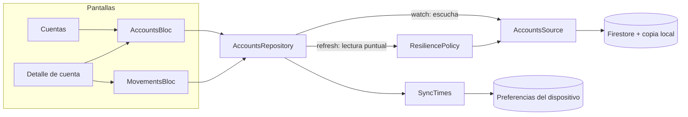

# 0012. Lectura de cuentas y movimientos en tiempo real, con la copia local de Firestore como caché

- **Estado:** Aceptada
- **Fecha:** 2026-10-03
- **Implementación:** existe el paquete `packages/feature_accounts` (solo lectura) con el repositorio, un Bloc por conjunto de datos, la pantalla de cuentas, el detalle de cuenta con sus movimientos y la ficha de un movimiento. La aplicación tiene navegación inferior con cuatro secciones. El índice compuesto de movimientos está desplegado y hay una herramienta de desarrollo que carga datos de demostración. **Verificado en un teléfono Android real contra el proyecto de Firebase:** lista de cuentas, detalle, los cuatro filtros, la búsqueda (con y sin resultados), la ficha de un movimiento, la copia de la referencia, la paginación, los datos guardados en modo avión (también tras cerrar y abrir la aplicación sin conexión) y la recuperación al volver la conexión. **No verificado:** la conexión lenta y la caída parcial de un servicio en un dispositivo (solo en pruebas automáticas), nada en iOS, y la llegada de trazas y eventos a la consola de Firebase.

## Problema a resolver

El enunciado pide gestión de cuentas, saldos y movimientos, y pide demostrar el comportamiento con conectividad limitada, alta latencia e indisponibilidad parcial, con estados de carga, reintentos, caché y recuperación. Hay que decidir:

- Cómo se leen los datos y qué hace de caché cuando no hay conexión.
- Cómo sabe el cliente si lo que ve está confirmado por el servidor o es una copia, y de cuándo.
- Cómo se modelan los movimientos y cómo se paginan.
- Cómo se representa el dinero.
- Cómo se evita que la falla de una parte deje la pantalla entera sin contenido.
- Qué ve un cliente que todavía no tiene cuentas.

## Alternativas evaluadas

**Lectura y caché**

1. **Escuchas en tiempo real de Firestore, con la persistencia local del SDK como caché.** El SDK guarda en el dispositivo lo que ya leyó y responde desde ahí sin conexión. No hay que escribir ni invalidar una caché propia.
2. **Lecturas puntuales con una caché propia** (por ejemplo, en una base local). Control total del formato y de la caducidad; obliga a duplicar los datos, a decidir cuándo invalidarlos y a mantener dos fuentes sincronizadas.
3. **Lecturas puntuales sin caché.** Lo más simple; sin conexión no habría nada que mostrar, que es justo lo que el enunciado pide evitar.

**Origen y antigüedad de los datos**

1. **Etiquetar cada entrega** con su origen (servidor o copia) y con el momento de la última sincronización, guardado aparte por conjunto de datos.
2. **Usar el campo `updatedAt` del documento.** Dice cuándo cambió el dato en el servidor, no cuándo lo confirmó este dispositivo: una cuenta sin movimientos en un mes parecería desactualizada estando al día.
3. **No decir nada.** El cliente no distinguiría un saldo confirmado de uno de hace horas.

**Modelo de movimientos**

1. **Colección plana `users/{uid}/movements`, con el identificador de la cuenta en cada documento** y un índice compuesto por cuenta y fecha.
2. **Subcolección por cuenta, `accounts/{id}/movements`.** No necesita índice compuesto; una vista de «últimos movimientos» de todas las cuentas, que el inicio necesitará, exigiría una consulta por grupo de colecciones y reglas adicionales.

**Paginación**

1. **Una escucha con límite creciente:** veinte movimientos, y veinte más cada vez que el cliente lo pide.
2. **Cursores (`startAfter`) con una escucha por página.** Lee menos al paginar; hay que coordinar varias escuchas y sus huecos cuando llega un movimiento nuevo.
3. **Cargar todo el historial.** Costo y tiempo crecen sin límite con la antigüedad de la cuenta.

**Dinero**

1. **Centavos como enteros.**
2. **Números decimales.** La suma de `0.1` y `0.2` no es `0.3`; en dinero ese error no es aceptable.

**Estado en pantalla**

1. **Un Bloc por conjunto de datos** (cuentas; movimientos de una cuenta), cada uno con su carga y su falla.
2. **Un Bloc por pantalla.** Menos piezas; la falla de los movimientos arrastraría el saldo.

## Opción seleccionada

**Escuchas en tiempo real con la persistencia del SDK como caché, colección plana de movimientos, centavos enteros y un Bloc por conjunto de datos.**

**Dos entradas por conjunto de datos.** `watch` sigue los datos en tiempo real y también responde desde la copia local, de modo que hay algo que mostrar sin conexión. `refresh` pregunta al servidor una vez, a través de la política de resiliencia ([ADR 0009](0009-politica-de-resiliencia.md)): tiempo límite, hasta tres intentos porque leer es idempotente, y un resultado tipado. La primera carga, el gesto de actualizar y «Reintentar» usan `refresh`. Cuentas y movimientos se identifican ante la política como servicios distintos (`accounts` y `movements`), así que uno puede fallar o ser desactivado desde el laboratorio de resiliencia mientras el otro responde.

**Cada entrega dice de dónde viene y de cuándo es.** El repositorio marca cada entrega como confirmada por el servidor o tomada de la copia local. Cuando el servidor confirma, guarda el momento en las preferencias del dispositivo, por cliente y por conjunto de datos; solo se guarda la hora, nunca los datos. Con eso la pantalla puede escribir «Actualizado hace 8 min» incluso tras cerrar y abrir la aplicación sin conexión.

**Una copia vacía en un dispositivo que nunca sincronizó no se muestra.** Sin conexión y sin lectura previa, Firestore entrega una lista vacía «desde la copia». Mostrarla afirmaría que el cliente no tiene cuentas sin saberlo. El repositorio la descarta mientras no exista una sincronización registrada.

**El estado separa lo que se puede mostrar de si actualizarlo falló.** `LoadState` guarda por un lado el último valor, su origen y su antigüedad, y por otro si hay una actualización en curso o fallida. De ahí salen los estados del diseño:

| Situación | Qué se ve |
|---|---|
| Sin datos, cargando | Marcadores con la forma del contenido real |
| Datos de la copia, sin conexión | Aviso de falta de conexión y «Actualizado hace N min» |
| Datos de la copia, el servidor no respondió | Los datos, su antigüedad, y un aviso con «Reintentar» |
| Sin datos, falló la carga | Mensaje de error con «Reintentar»; tras agotar los intentos dice cuántos se hicieron |
| Datos del servidor, lista vacía | «Estamos preparando tu cuenta» |
| Datos del servidor | El contenido, sin indicar antigüedad |

Sin conexión no se añade el aviso de «no pudimos actualizar»: el aviso general ya lo explica y un reintento no podría funcionar. Esa redundancia se detectó al probar en un teléfono en modo avión.

**Movimientos.** Viven en `users/{uid}/movements`, con el identificador de la cuenta. La consulta filtra por cuenta, ordena por fecha descendente y limita a la página; necesita el índice compuesto declarado en `firebase/firestore.indexes.json`. La paginación amplía el límite de la escucha en veinte. El filtro (Todos, Ingresos, Egresos, Este mes) y la búsqueda se aplican sobre los movimientos ya cargados, con funciones puras: la búsqueda ignora mayúsculas y tildes, y «este mes» depende de un reloj inyectado.

**Dinero en centavos enteros.** Todos los importes son enteros. El adaptador descarta una cuenta o un movimiento cuyo importe no sea un entero en lugar de redondearlo.

**Lectura tolerante.** Los campos desconocidos se ignoran. Una categoría o un canal desconocidos se muestran como «Otros». Un estado desconocido se muestra como pendiente: afirmar «completado» sin saberlo sería el peor error.

**Cliente sin cuentas.** El registro no abre cuentas; lo hará la API de servidor ([ADR 0004](0004-backoffice-y-api-en-nextjs.md)). Hasta entonces un cliente nuevo ve «Estamos preparando tu cuenta». Para desarrollo existe `firebase/seed`, que carga dos cuentas y sus movimientos con las credenciales del propio desarrollador.

**Solo lectura.** Las reglas de seguridad no cambian: el cliente lee lo que cuelga de su usuario y no escribe cuentas ni movimientos. Las pruebas de las reglas cubren la consulta exacta que hace la aplicación y que un cliente no puede leer ni consultar lo de otro.

**Acciones que no existen todavía no se muestran.** El diseño incluye «Transferir», «Compartir datos de cuenta», «Compartir comprobante» y «Reportar un problema». Ninguna tiene aún algo detrás, así que no aparecen. La ficha del movimiento ofrece copiar la referencia, que sí funciona.

**Telemetría.** Dos trazas miden la primera carga de cuentas y de movimientos, con el origen y la cantidad de elementos. Los eventos de falla, reintento y datos servidos desde la copia llevan el servicio, el tipo de falla y cantidades. Ningún importe, número de cuenta, descripción o nombre llega a la telemetría; los errores inesperados se informan solo con su tipo.

**Alcance del cliente.** El repositorio y el Bloc de cuentas se crean al iniciar sesión, por cliente, y se destruyen al cerrarla. Un segundo cliente en el mismo dispositivo empieza sin nada del anterior.

## Trade-offs

- **Se gana:** datos disponibles sin conexión sin escribir una caché; saldos que se actualizan solos cuando el servidor los cambia; el cliente siempre sabe si ve datos confirmados o guardados; la falla de los movimientos no oculta el saldo; ningún reintento puede mover dinero porque el paquete solo lee.
- **Se paga:**
  - **La caché es la del SDK.** No se controla su tamaño ni su caducidad más allá de lo que Firestore permite. Mientras la sesión está abierta, sus datos están en el dispositivo sin más cifrado que el del sistema.
  - **Cerrar sesión borra la copia local, y con ella el uso sin conexión.** Al terminar la sesión se cierran las escuchas del cliente, se detiene Firestore, se borra su copia y se eliminan las horas de sincronización. Un cliente que vuelve a entrar sin conexión no ve nada hasta sincronizar. Lo mismo se ejecuta al abrir la aplicación sin sesión, por si un uso anterior se cerró antes de terminar la limpieza. Si un paso falla se informa a telemetría y los demás se ejecutan igual. Lo único que queda es la preferencia de desbloqueo biométrico, un valor de sí o no asociado a un identificador opaco.
  - **El filtro y la búsqueda solo ven lo cargado.** Buscar un movimiento antiguo exige pedir más páginas primero. Filtrar en el servidor requeriría un índice por combinación de filtros.
  - **Ampliar el límite vuelve a leer la página anterior.** Con cursores se leería menos.
  - **«Ver más» puede aparecer de más.** Si la cuenta tiene exactamente un número de movimientos múltiplo de la página, el botón se muestra una vez sin que haya nada más.
  - **La antigüedad no avanza sola.** «Actualizado hace 8 min» se recalcula cuando la pantalla se redibuja, no cada minuto.
  - **Un índice que mantener.** La consulta de movimientos falla si el índice no está desplegado.
  - **«Intento 2 de 3» no se muestra.** El diseño lo incluye; la pantalla solo indica el progreso del reintento y, al agotarse, cuántos intentos hubo.
  - **Una lectura puntual además de la escucha.** `refresh` lee del servidor lo que la escucha también traerá. Es el precio de saber, con tiempo límite, si el servidor responde.

## Impacto a largo plazo

- **Facilita:** el inicio dinámico reutiliza el mismo repositorio y los mismos componentes (`AccountCard`, `MovementRow`) para sus módulos de saldo, cuentas y últimos movimientos; las transferencias solo necesitan escribir a través del servidor, porque las escuchas ya reflejarán el nuevo saldo.
- **Restringe:** los nombres de los campos son un contrato con quien escriba los datos (la herramienta de carga hoy, la API de servidor después). Cambiarlos exige cambiar ambos lados.
- **Costo de revertir:** medio. El resto de la aplicación depende de `AccountsRepository`, no de Firestore; sustituir la fuente por una API propia significa escribir otro adaptador y decidir qué hace de caché.

Convendría revisar la decisión si el historial crece hasta hacer lento el límite creciente, si se necesita buscar en todo el historial, o si un requisito regulatorio obliga a cifrar la copia local con una clave propia mientras la sesión está abierta.
