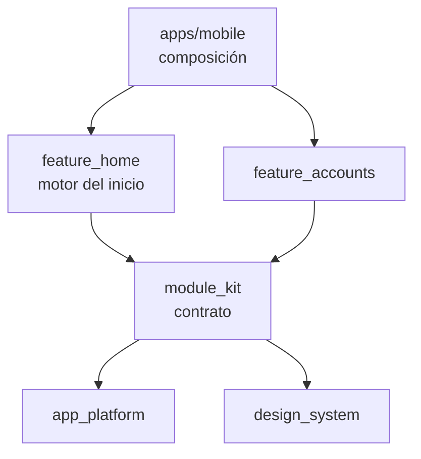

# 0013. Registro de módulos y motor del inicio

- **Estado:** Aceptada
- **Fecha:** 2026-10-03
- **Implementación:** construida en la etapa 6. Paquetes `packages/module_kit` y `packages/feature_home`, módulos del dominio de cuentas en `packages/feature_accounts`, composición en `apps/mobile`. Lo que se comprobó en un teléfono y lo que solo está cubierto por pruebas se detalla en [conectividad degradada](../operacion/conectividad-degradada.md).

Esta decisión concreta la [0005](0005-home-dirigido-por-configuracion.md), que eligió el enfoque. Aquí se decide cómo se reparte el código entre paquetes y qué se promete a cada equipo.

## Problema a resolver

El inicio debe armarse en tiempo de ejecución a partir de la configuración publicada, por segmento, y cada parte debe poder fallar sin llevarse a las demás. Además, varios equipos aportan módulos: si el inicio importa a cada dominio, o los dominios se importan entre sí, el inicio se convierte en el punto donde todos editan el mismo código y un cambio en cuentas obliga a recompilar y revisar servicios.

Hay que decidir tres cosas: dónde vive el contrato entre el inicio y los dominios, quién es dueño del estado de cada módulo y cómo sabe el inicio que no hay nada que mostrar sin conocer los datos de nadie.

## Alternativas evaluadas

1. **El inicio importa los paquetes de dominio y elige el widget con un `switch` sobre el tipo.** Es lo más corto. Cada módulo nuevo edita el paquete del inicio y lo acopla a todos los dominios.
2. **Los dominios importan el paquete del inicio para registrarse en él.** Elimina el `switch`, pero cada dominio pasa a depender del motor completo, y el motor no puede probarse sin ellos.
3. **Un paquete de contrato pequeño del que dependen el inicio y los dominios.** El contrato define el registro, lo que recibe un módulo y cómo se resuelve un destino. Ni el inicio conoce a los dominios ni los dominios al inicio.
4. **Interfaz remota completa, actualización de código en caliente o vistas web para el inicio.** Descartadas en la decisión 0005: la primera traslada al servidor la accesibilidad y las pruebas, la segunda es un mecanismo de despliegue sujeto a las políticas de las tiendas y la tercera pierde el sistema de diseño nativo y el funcionamiento sin conexión.

Para el estado:

- **Un único Bloc para todo el inicio.** Una falla de movimientos obligaría a decidir en un solo lugar qué se muestra de todo lo demás.
- **Un estado por conjunto de datos, propiedad del dominio que lo lee.** Cada módulo decide qué dibuja cuando sus datos fallan y el inicio solo se entera del resultado.

## Opción seleccionada

La opción 3, con un estado por conjunto de datos.

- **`module_kit`** contiene el contrato y nada más: `HomeModuleRegistry` (tipo de módulo → constructor), `HomeModuleContext` (identificador, propiedades publicadas, resolutor de destinos y anfitrión), `DestinationResolver` y `HomeModuleHost`. Una prueba de arquitectura impide que importe un dominio, Firebase o un plugin.
- **`feature_home`** es el motor. `HomeCompositionCubit` escucha la configuración y produce la composición: los módulos visibles del segmento del cliente, en el orden publicado, descartando los tipos que nadie registró. `HomeScreen` dibuja esa composición pidiendo cada widget al registro. También aporta los dos módulos que no tienen datos propios, `quickActions` y `promoBanner`, que se dibujan solo con lo publicado.
- **`feature_accounts`** registra `totalBalance`, `accountCarousel` y `recentMovements`. Los dos primeros leen el mismo `AccountsBloc`; el tercero tiene su propio `RecentMovementsBloc`, con el identificador de servicio `movements`, de modo que el laboratorio de resiliencia puede tumbarlo sin tocar las cuentas.
- **`apps/mobile`** registra los módulos de cada dominio al componer la aplicación y aporta el único `DestinationResolver`, que traduce los destinos de la lista cerrada del contrato a rutas. Un destino sin pantalla, o cuya funcionalidad está apagada para el segmento, no se resuelve y el módulo no dibuja la acción: no hay botones que no llevan a ningún lado.

### Qué pasa con cada caso

| Situación | Comportamiento |
|---|---|
| Se publica un orden distinto o se oculta un módulo | El inicio se recompone sin reiniciar. Los módulos que permanecen conservan su estado, porque se identifican por su `id`. |
| El perfil del cliente cambia de segmento | Se recompone con la lista de ese segmento. Un segmento desconocido usa el de reserva del contrato. |
| La configuración nombra un tipo que esta versión no registra | Se omite y se informa una vez a telemetría, solo con el tipo. Hoy ocurre con `investmentSummary` y `serviceRecommendations`. |
| Un módulo con datos falla y no tiene nada guardado | Muestra su propio error con «Reintentar». Los demás siguen en pantalla. |
| Todos los módulos con datos fallan sin nada guardado | El inicio muestra un único error para toda la pantalla y reintenta todos a la vez. Los módulos siguen montados y el inicio vuelve en cuanto uno tiene datos. |
| El cliente desliza para actualizar | El inicio pide a cada módulo que se actualice y espera a todos. |

El inicio distingue «falló un módulo» de «no hay nada que mostrar» sin conocer los datos: cada módulo con datos informa su estado (esperando, listo, falló) al anfitrión y registra cómo se actualiza.

### Cómo agrega un módulo un equipo nuevo

1. En su paquete, escribe el widget del módulo y lo envuelve en `HomeModuleBinding` si tiene datos propios.
2. Expone una función que lo registra con su tipo en un `HomeModuleRegistry`.
3. En `apps/mobile`, añade la llamada a esa función en `composeHomeModules`. Es la única línea fuera de su paquete.
4. Publica una configuración que incluya el tipo. Las versiones instaladas que no lo conocen lo omiten.

### `investmentSummary` queda sin registrar

No existe un modelo de inversiones ni datos reales que mostrar. Dibujar cifras inventadas dentro del widget sería peor que no dibujar nada, así que el tipo no se registra y el inicio lo omite. Es, además, una demostración en vivo de la regla de tolerancia: la configuración del segmento Patrimonio lo publica y la aplicación instalada sigue funcionando.

## Trade-offs

- **Se gana:** el inicio no cambia cuando se añade un módulo, cada dominio prueba los suyos sin el motor y una falla queda contenida donde ocurre. El contrato es pequeño y se lee en unos minutos.
- **Se paga:** un tipo de módulo nuevo exige publicar la aplicación; la configuración solo combina lo que ya está instalado. Es el límite aceptado en la decisión 0005.
- **Se paga:** hay un paquete más que mantener, y un cambio incompatible en él afecta a todos los dominios a la vez. Por eso se mantiene mínimo.
- **Se paga:** las propiedades de cada módulo son un mapa sin tipos. Cada módulo las lee con tolerancia (lo que falta o tiene otro tipo equivale al valor por defecto), y un error de escritura en la consola no se detecta hasta validar contra el esquema.
- **Límite conocido:** el inicio informa los tipos omitidos, pero no avisa al cliente de que falta algo. Es deliberado: una versión antigua no debe mostrar huecos por módulos que no conoce.
- **Límite conocido:** `ConnectionBanner`, el aviso de conexión que comparten las secciones, vive en `module_kit` porque es lo único que todas las secciones ya importan. Si el paquete creciera con más widgets compartidos, convendría separarlos.
- **Fuera de alcance:** la línea de tendencia de 30 días del saldo total que publica el segmento Patrimonio (`trendDays`). El módulo ignora esa propiedad; calcularla exige leer los movimientos del periodo y no se construyó.

## Impacto a largo plazo

- Las aplicaciones ya instaladas conviven con configuraciones más nuevas: omiten los tipos y los destinos que no conocen y siguen leyendo el resto. Lo que no toleran es un cambio de versión del esquema, que se trata según la [decisión 0008](0008-contrato-de-configuracion.md).
- El resolutor de destinos es el mismo punto por el que entrarán las notificaciones y los banners de las etapas siguientes, así que una pantalla nueva se habilita en un solo lugar y queda disponible para todos.
- Si los equipos llegaran a necesitar publicar interfaz que no existe en la aplicación instalada, habría que revisar esta decisión junto con la 0005: el registro seguiría siendo el punto de extensión, con un tipo de módulo que interprete una descripción remota.
