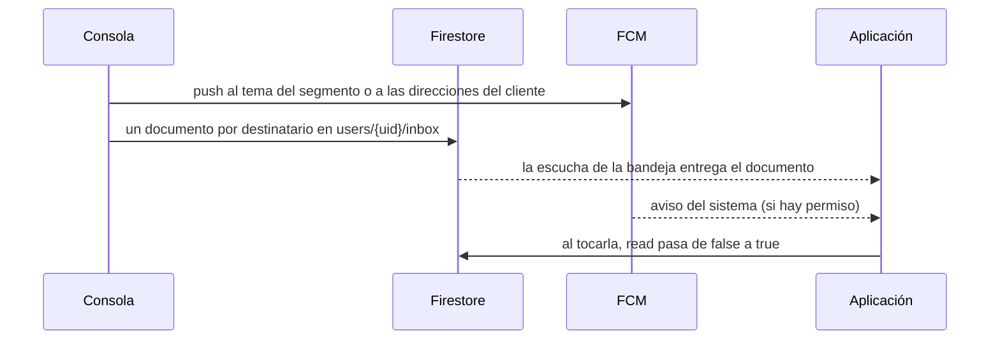

# 0018. Notificaciones push y bandeja del cliente

- **Estado:** Aceptada
- **Fecha:** 2026-10-03
- **Implementación:** construida en la etapa 9. Paquete `packages/feature_notifications`, cableado en `apps/mobile` (`notifications_wiring.dart`, `notifications_composition.dart`), reglas de `users/{uid}/devices` y `users/{uid}/inbox` en `firebase/firestore.rules`, y escritura de la bandeja al enviar en `apps/backoffice/lib/server/push.ts`. Verificada con pruebas, con el emulador de reglas y, tras la integración, en un teléfono Android con entrega real: ver «Qué no está verificado» para lo que se vio y lo que falta.

## Problema a resolver

El enunciado pide notificaciones push para clientes. Una notificación push, por sí sola, es un aviso que el sistema operativo puede no entregar: el cliente puede no haber dado permiso, tener el teléfono apagado o haber descartado el aviso sin leerlo. Si la notificación solo existe como push, lo que el banco le dijo al cliente se pierde.

Hay que decidir cinco cosas:

1. Dónde vive la notificación para que el cliente la encuentre después.
2. A quién se dirige un envío: a un segmento o a una persona.
3. Cuándo se pide el permiso del sistema, que solo se puede pedir una vez.
4. Qué pasa con el dispositivo cuando el cliente cierra sesión.
5. Qué ocurre al tocar una notificación.

## Alternativas evaluadas

**Dónde vive la notificación**

1. **Solo push.** Lo más simple. No hay historial, y quien no dio permiso no recibe nada.
2. **El teléfono guarda lo que recibe.** Hay historial, pero solo de lo que llegó a ese teléfono mientras tenía permiso, y se pierde al cerrar sesión, donde la aplicación borra todo lo guardado del cliente.
3. **El servidor escribe una bandeja por cliente y el push solo la anuncia.** La bandeja es la fuente de verdad: está aunque el push no llegue, es la misma en todos los dispositivos del cliente y se lee con las mismas garantías que las cuentas.

**A quién se dirige**

- **Solo temas por segmento.** No requiere guardar direcciones, pero no permite escribirle a una persona.
- **Solo direcciones por dispositivo.** Permite todo, pero un envío a un segmento obliga a leer todas las direcciones.
- **Tema por segmento y direcciones por cliente.** Cada caso usa lo que le conviene.

**Cuándo pedir permiso**

- **Al abrir la aplicación.** Es lo habitual y lo que más rechazos produce: el cliente aún no sabe para qué son.
- **Con una invitación propia antes del aviso del sistema, en contexto.** El aviso del sistema solo aparece si el cliente acepta la invitación; un «Ahora no» no lo gasta.

## Opción seleccionada

**Bandeja escrita por el servidor, con FCM como aviso.** Al enviar, la consola escribe un documento por destinatario en `users/{uid}/inbox/{id}` con título, texto, tipo, destino, fecha y `read: false`, y además manda el push. El identificador es el del registro del envío, de modo que un reintento escribe el mismo documento y no duplica.

- **Reglas.** El cliente lee su bandeja y solo puede cambiar `read` de `false` a `true`. No crea, no borra y no cambia ningún otro campo: una notificación del banco no la puede escribir ni alterar un cliente.
- **Envío a un segmento.** El push va al tema `segment-<id>`. La bandeja se escribe para los clientes del segmento en un solo lote de la base de datos, hasta 500. Si el segmento es mayor, el registro del envío lo dice (`inboxTruncated`).
- **Envío a una persona.** El push va a las direcciones guardadas en `users/{uid}/devices`, y la bandeja a ese cliente.
- **Ensayos.** Un envío en modo de prueba no escribe bandejas: no se anunció nada.
- **Tipo.** La consola no tiene un campo para el tipo; se deduce del destino (cuentas o transferencia: movimiento; perfil: seguridad; el resto: beneficio).

**Registro del dispositivo.** Con permiso concedido y sesión iniciada, la aplicación guarda `users/{uid}/devices/{deviceId}` con `token`, `platform` y `updatedAt`, y se suscribe al tema de su segmento. Si el cliente cambia de segmento, deja el tema anterior y sigue el nuevo. Si el servicio rota la dirección, la aplicación reemplaza el documento entero, con lo que desaparece la marca `unregistered` que la consola hubiera puesto sobre la dirección anterior. Las reglas permiten al dueño crear, reemplazar y borrar sus dispositivos, con tres campos exactos, dirección acotada y hora del servidor.

**Invitación antes del permiso.** La primera vez que un cliente inicia sesión en un dispositivo donde el sistema aún no preguntó, la aplicación muestra su invitación sobre el inicio. Solo si acepta aparece el aviso del sistema. «Ahora no» se recuerda en el dispositivo y la aplicación no vuelve a invitar por su cuenta; la bandeja ofrece activarlas cuando el cliente quiera. Si el permiso está denegado en el sistema, la bandeja lo dice y lleva a los ajustes.

**Cierre de sesión.** Hay dos caminos y los dos limpian el dispositivo.

- **El cliente pulsa «Cerrar sesión».** Antes de cerrar, la aplicación deja el tema, borra el documento del dispositivo y elimina la dirección local. El orden importa: borrar el documento exige una sesión. La orden tiene efecto inmediato (una operación de registro que estuviera a medias no escribe nada al terminar) y la espera está acotada a 5 segundos: un cliente no queda con la sesión abierta porque la red no responde.
- **La sesión termina por otra vía** (revocada, caducada, biometría eliminada del dispositivo, pantalla de sesión no disponible). La aplicación reacciona al estado «sin sesión», venga de donde venga, y hace lo que todavía es posible sin credenciales: deja el tema y elimina la dirección local. El documento del dispositivo ya no se puede borrar; queda apuntando a una dirección que dejó de existir, la consola lo marca como no registrado en el siguiente envío y el mismo cliente lo reemplaza al volver a entrar.

**Teléfono compartido.** El dispositivo recuerda, fuera de cualquier sesión, para quién quedó registrado y qué temas sigue. Antes de registrar a un cliente, si ese recuerdo nombra a otro, se dejan sus temas y se elimina su dirección; si la dirección anterior no se puede eliminar, el cliente nuevo no se registra hasta que se pueda. Lo mismo se comprueba al arrancar sin sesión, lo que cubre una sesión que terminó con la aplicación cerrada. El recuerdo guarda un identificador y nombres de temas, nada del cliente.

**Un solo tema por dispositivo.** Al cambiar de segmento se deja el tema anterior antes de seguir el nuevo. Si no se puede dejar, se reemplaza la dirección, que nace sin suscripciones; si tampoco se puede, el dispositivo se queda solo en el tema anterior y lo reintenta, nunca en dos.

**Permiso retirado.** Al volver a primer plano se vuelve a leer el permiso. Si el cliente lo desactivó en los ajustes del sistema, se retira el registro y el tema.

**Al tocar una notificación.** El destino se resuelve con el mismo resolvedor que usan las acciones del inicio. Un destino que esta versión no puede abrir lleva a la bandeja. Con la aplicación abierta el sistema no muestra nada, así que la aplicación muestra un aviso propio; la bandeja se actualiza por su escucha. Una notificación tocada sin sesión o con la sesión bloqueada no se pierde ni salta el bloqueo: queda en espera, fuera de la sesión, y se abre cuando el cliente ya está dentro. La que inició la aplicación se entrega una sola vez por proceso.

**Privacidad en la pantalla bloqueada.** El canal de Android se crea con visibilidad privada: con el teléfono bloqueado el sistema indica que llegó un aviso sin mostrar su texto. Aun así, la regla de redacción es que el título y el texto de un push no llevan montos, números de cuenta ni datos personales: el detalle vive en la bandeja, detrás de la sesión. Los ejemplos del diseño con montos en el título son contenido de la bandeja, no texto recomendado para un push.

## Trade-offs

- **Se gana:** el cliente encuentra lo que el banco le dijo aunque el push no haya llegado; la bandeja falla y se recupera por separado de cuentas y movimientos (servicio `notifications` en la política de resiliencia); sin conexión muestra lo guardado; al cerrar sesión el dispositivo deja de recibir lo del cliente.
- **Se paga, un envío a un segmento escribe un documento por cliente.** Con 500 por envío alcanza para la demostración. En producción la escritura se haría desde una cola, o los avisos de segmento vivirían en una colección compartida que la aplicación combina con la bandeja personal.
- **Se paga, el push y la bandeja no son una sola operación.** Si el push sale y la bandeja falla, el envío queda como enviado y el registro anota el error (`inboxError`). No hay reintento automático de la bandeja.
- **Se paga, la entrega del push no está garantizada.** FCM entrega «en lo posible». El servidor no sabe si un push a un tema llegó a alguien. Por eso la bandeja es la fuente de verdad y no al revés.
- **Se paga, tocar el aviso del sistema no marca la notificación como leída.** El push no lleva el identificador de la bandeja; se marca al tocarla en la bandeja.
- **Se paga, el tipo se deduce del destino.** Un beneficio que lleve a las cuentas se dibuja como movimiento. Un campo de tipo en la consola lo resolvería.
- **Corregido tras la revisión, sesión que termina por otra vía y teléfono compartido.** La primera versión solo olvidaba el dispositivo al pulsar «Cerrar sesión». Una sesión revocada o caducada dejaba la dirección registrada y el tema suscrito, y el siguiente cliente en ese teléfono habría recibido avisos del anterior. Ahora se limpia en toda vía de cierre y antes de registrar a otro cliente, como se describe arriba.
- **Límite que queda, el documento del dispositivo tras un cierre sin sesión.** No se puede borrar desde el cliente. No entrega nada, porque su dirección ya no existe, pero permanece hasta que el cliente vuelve a entrar o un proceso del servidor lo elimina. Producción añadiría esa limpieza en el servidor, al revocar una sesión.
- **Límite que queda, ventana sin red.** Dejar un tema y eliminar la dirección requieren conexión. Si la sesión termina sin red, lo pendiente queda anotado en el dispositivo y se completa en el siguiente arranque o registro; hasta entonces un push al tema anterior podría llegar. Por eso los textos de un push no llevan datos sensibles.
- **Bandeja truncada o no escrita.** Un envío a un segmento escribe la bandeja de hasta 500 clientes. El historial de la consola dice bajo cada envío en cuántas bandejas quedó, si se truncó o si no pudo escribirse; el código del error se queda en el servidor.
- **Límite conocido, Android no distingue «aún no preguntado» de «denegado».** La aplicación recuerda en el dispositivo si ya mostró el aviso del sistema. Si esa memoria se borra, un permiso denegado se toma por no preguntado y la invitación vuelve a aparecer una vez.
- **Límite conocido, abrir los ajustes del sistema está implementado solo en Android**, por un canal propio en `MainActivity`. En iOS la llamada se informa a telemetría y no hace nada.

### Qué no está verificado

Tras la integración se ejecutó en un teléfono Android, con la consola en local y entrega real. Se vio: la invitación sobre el inicio y el aviso en la bandeja tras «Ahora no»; el aviso de permiso del sistema y el documento del dispositivo con sus tres campos; un envío a un cliente recibido con la aplicación abierta, en segundo plano y cerrada, la campana con el contador, el aviso como «Nueva» y su marca de leído al tocarlo; el historial de la consola con «En la bandeja de 1 cliente»; el permiso retirado, que quitó el registro y mostró el aviso con «Activar en Ajustes», y su vuelta; un envío al segmento por tema, y tras cambiar de segmento el tema anterior en silencio y el nuevo recibido; el cierre de sesión, que eliminó el documento del dispositivo y dejó de recibir; y un segundo cliente en el mismo teléfono, al que no llegó nada dirigido al primero ni a su segmento. Las reglas de dispositivos y bandeja están desplegadas.

Esa ejecución encontró dos defectos, corregidos con una prueba que falló primero: el aviso de un push recibido con la aplicación abierta no se retiraba solo y seguía en pantalla sobre otras pantallas, y un aviso tocado con la aplicación cerrada caía en la bandeja porque se abría antes de leerse la configuración.

Sigue sin verificar: que el texto no se vea en la pantalla bloqueada (se comprobó que el aviso llega con visibilidad privada, no bloqueando el teléfono), el aviso tocado con el bloqueo biométrico activo, la sesión revocada desde la consola de Firebase, y todo lo de iOS (capacidad de notificaciones, APNs y `UIBackgroundModes`: la aplicación funciona en un iPhone, pero sin clave APNs ni la capacidad de notificaciones no recibe avisos). Tocar un aviso del sistema no lo marca como leído en la bandeja.

## Impacto a largo plazo

- La bandeja admite cualquier emisor futuro (transferencias, seguridad, campañas) sin tocar la aplicación: basta con que el servidor escriba el documento con un destino de la lista del contrato.
- Los destinos de las notificaciones y los del inicio comparten resolvedor. Un destino nuevo se habilita una vez y sirve para ambos.
- Si el volumen crece, la escritura por destinatario es lo primero que hay que mover a un proceso en segundo plano; el contrato del documento no cambia.
- La decisión de pedir permiso con invitación propia es independiente del proveedor: cambiar FCM por otro servicio solo toca el adaptador.
