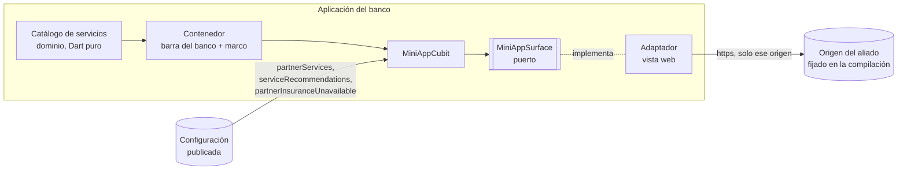
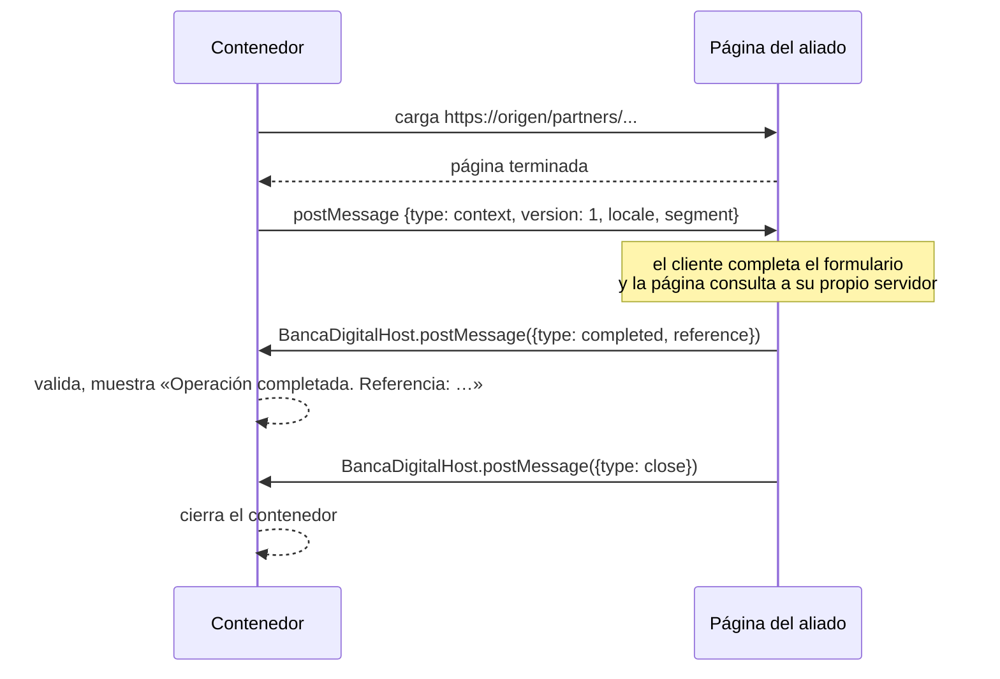

# 0019. Servicios y mini aplicaciones de aliados

- **Estado:** Aceptada
- **Fecha:** 2026-10-03
- **Implementación:** construida en la etapa 10. Paquete `packages/feature_services`, composición en `apps/mobile/lib/services_wiring.dart`, y dos mini aplicaciones de aliados simulados en `apps/backoffice/app/partners` y `apps/backoffice/lib/partners`. Cubierta por pruebas; **no se ha ejecutado todavía en un dispositivo**: la vista web real, el borrado de sus datos al cerrar sesión y la apertura del navegador solo se comprueban en un teléfono.

## Problema a resolver

El enunciado pide integrar al menos un servicio o micro aplicativo externo relevante para el ecosistema, y que la plataforma pueda sumar productos de terceros sin publicar una versión nueva de la aplicación.

Integrar a un tercero dentro de la aplicación de un banco plantea cuatro preguntas que no admiten una respuesta improvisada:

- **Qué puede hacer el contenido del aliado** dentro de la aplicación, y qué no.
- **Qué sabe el aliado del cliente** al abrirse.
- **Qué ve el cliente cuando el aliado falla**, que es un fallo ajeno al banco.
- **Qué exige una versión nueva** y qué se cambia solo publicando configuración.

## Alternativas evaluadas

1. **Integrar el SDK nativo de cada aliado.** Da la mejor experiencia, pero cada aliado nuevo es código suyo compilado dentro de la aplicación del banco, con sus permisos y sus dependencias, y exige una versión nueva por aliado y por cada cambio del aliado.
2. **Abrir la aplicación propia del aliado con un enlace profundo.** El aliado conserva todo el control y el banco no carga código ajeno, pero el cliente sale de la aplicación, puede no tener instalada la del aliado y el banco no puede decir nada cuando el servicio no responde.
3. **Un entorno de ejecución de «super app»**, con un formato propio de mini programas, un puente de capacidades y una tienda interna. Es lo que usan las plataformas que integran a cientos de terceros. Requiere un equipo dedicado y un proceso de certificación; desproporcionado para dos servicios.
4. **Un contenedor con una vista web**, que carga la página del aliado desde un origen fijado en la compilación y habla con ella por un contrato de mensajes mínimo.

## Opción seleccionada

La opción 4: un contenedor propio del banco alrededor de una vista web.

### Lo que ve el cliente

- **Servicios** lista dos secciones, «Del banco» y «De aliados». Una fila solo aparece si la aplicación puede abrir su destino en ese momento: un producto sin pantalla en esta versión, o un aliado apagado en la configuración, no deja una fila muerta.
- **El contenedor** tiene una barra que es del banco y no desaparece nunca: nombra el servicio, dice de quién es («Servicio de Aliado Seguros») y lo cierra. Debajo, el rótulo «Contenido de Aliado Seguros» y la página dentro de un marco con borde y esquinas rectas, que no se parece a nada más de la aplicación. La página del aliado usa su propia tipografía y sus propios colores a propósito: el cliente tiene que distinguir de un vistazo dónde termina el banco.
- **Cuando el aliado falla**, la barra sigue en su sitio y el contenido se reemplaza por «Servicio no disponible», con el mensaje «Tu cuenta y tus saldos no se ven afectados», «Reintentar» y «Volver a Servicios».
- **«Para ti»**, en el inicio, recomienda los servicios que la configuración publica para el segmento del cliente.

### Reglas del contenedor

| Regla | Dónde se decide | Prueba |
| --- | --- | --- |
| Solo se carga contenido del origen fijado en la compilación, y solo por `https`. El `http` se acepta únicamente si la compilación marca el origen como de desarrollo. | `PartnerOrigin` | `partner_origin_test.dart` |
| Una navegación a otro sitio seguro no se abre dentro del contenedor: se ofrece abrirla en el navegador del teléfono. Cualquier otra cosa (`http` ajeno, `file:`, `content:`, `intent:`, `javascript:`, `data:`) se descarta sin ofrecer nada. | `judgeNavigation` | `navigation_test.dart` |
| Un marco incrustado que apunta a otro sitio se bloquea sin preguntar al cliente. | `MiniAppCubit` | `mini_app_cubit_test.dart` |
| La página no recibe acceso a archivos ni a contenido del dispositivo, y se le niega todo permiso (cámara, micrófono, ubicación). | Adaptador de la vista web | Solo en dispositivo |
| El anfitrión envía a la página dos datos: idioma y segmento. Ningún identificador, nombre, saldo ni credencial. | `HostContext` | `host_contract_test.dart` |
| La página puede enviar dos mensajes: `close` y `completed`, este con una referencia opcional de hasta 40 caracteres alfanuméricos. Todo lo demás se descarta y se cuenta. | `parsePartnerMessage` | `host_contract_test.dart` |
| La carga tiene un límite de 15 segundos. Vencido, un error HTTP o un fallo de carga de la página llevan a «Servicio no disponible». Un recurso secundario que falla no. | `MiniAppCubit`, `PageEvents` | `mini_app_cubit_test.dart`, `page_events_test.dart` |
| Las cookies, la caché y el almacenamiento de la vista web se borran al cerrar sesión, con el resto de los datos del cliente. | `apps/mobile/lib/composition.dart` | Solo en dispositivo |

### Contrato de mensajes

El contexto se entrega con `window.postMessage` dirigido al origen del aliado, de modo que el navegador solo lo entrega a un documento que siga en ese origen. La página lo usa, por ejemplo, para aplicar un descuento al segmento Familia sin saber quién es el cliente.

### Resiliencia

Antes de cargar, el contenedor pregunta a la política de resiliencia si el aliado es alcanzable. Así, sin conexión, con latencia inyectada o con el aliado dado por caído desde el laboratorio de resiliencia, la mini aplicación recorre el mismo camino que cualquier otro servicio. El interruptor `partnerInsuranceUnavailable` deja fuera el seguro de viaje en el momento en que se publica, también si está abierto, y lo recupera solo al levantarse. No afecta a Recargas. En una compilación sin `ALLOW_FAULT_INJECTION` no tiene efecto.

### Qué exige una versión nueva y qué no

| Cambio | ¿Versión nueva? |
| --- | --- |
| Encender o apagar los servicios de aliados para un segmento (`partnerServices`) | No. Se publica. |
| Recomendar un servicio en el inicio de un segmento, o dejar de hacerlo | No. Se publica. |
| Llevar a un servicio desde un banner o una acción rápida | No. Se publica un destino `partner:…`. |
| Cambiar la página del aliado: campos, precios, textos, flujo | No. Es contenido del aliado. |
| Dar de baja un servicio por una incidencia | No. Se apaga el indicador. |
| Sumar un aliado nuevo al catálogo | Sí: una entrada en `ServiceCatalog`. |
| Cambiar el origen desde el que se carga el contenido | Sí: es un valor de compilación, a propósito. |
| Ampliar el contrato de mensajes | Sí. |

Sumar un aliado exige una versión porque el catálogo, con el nombre del aliado que se muestra al cliente y la ruta que se carga, está en el código. Es una decisión consciente: lo que el banco le dice al cliente sobre de quién es un servicio no debería poder cambiarse publicando un documento. La alternativa, un catálogo publicado con una lista de orígenes permitidos por aliado, se describe en el impacto a largo plazo.

### Lo que está simulado

Los dos aliados, «Aliado Seguros» y «Aliado Recargas», no existen. Sus mini aplicaciones son páginas reales con procesamiento real en el servidor, alojadas para la demostración en el mismo proyecto Next.js que la consola, bajo `/partners`:

- **Seguro de viaje** calcula una cotización en un manejador de ruta a partir de tarifas con nombre, por región, días y viajeros, con todo validado en el servidor. No emite ninguna póliza.
- **Recargas** valida un celular ecuatoriano, una operadora y un monto, y devuelve una referencia. No llama a ninguna operadora ni mueve dinero.

Ese código no comparte nada con la consola: no importa sus módulos, no usa su sesión ni Firebase y no deja cookies. Una prueba lo comprueba recorriendo sus importaciones. Las páginas se sirven como HTML plano con una política de seguridad de contenido que lo prohíbe todo salvo su propio guion y su propio estilo, identificados por un valor de un solo uso. Comprobado contra el servidor en local: las rutas responden sin ninguna variable de entorno de la consola. Una diferencia respecto de lo que piden sus manejadores: al estar alojadas con la consola, la cabecera `Referrer-Policy` que llega al cliente es la general del proyecto (`same-origin`) y no la más estricta que fijan ellas (`no-referrer`).

Con un tercero real cambiaría lo siguiente: el origen sería el suyo y no el del banco; la lista de orígenes permitidos pasaría a tener uno por aliado; habría un acuerdo sobre el contrato de mensajes y sus versiones; y el banco no controlaría las cabeceras ni el contenido de la página, por lo que las reglas del contenedor serían la única defensa.

## Trade-offs

- **Se gana:** un tercero entra en el ecosistema sin que su código se compile dentro de la aplicación del banco, y casi todo lo que cambia en la relación con él se publica sin versión nueva.
- **Se gana:** el fallo del aliado queda contenido en su marco, con un mensaje que es del banco.
- **Se paga:** una vista web no se siente nativa. No comparte el sistema de diseño, no funciona sin conexión y su accesibilidad depende del aliado.
- **Se paga:** la vista web es la superficie de ataque más delicada de la aplicación. Las reglas de arriba la acotan, pero no la eliminan.
- **Se paga:** la aplicación suma dos complementos, `webview_flutter` y `url_launcher`, y `webview_flutter_android` para fijar de forma explícita el acceso a archivos.

### Límites conocidos

- **El canal de mensajes es visible para todos los marcos de la página en Android.** Un marco incrustado de otro origen podría enviar mensajes. Los mensajes se validan y solo permiten cerrar el contenedor o mostrar una referencia corta, y las páginas de la demostración prohíben los marcos con su política de contenido; con un tercero real, esa garantía dependería de él.
- **No se comprueba la identidad del aliado más allá del origen.** No hay fijación de certificados ni App Check.
- **El aliado conoce el segmento del cliente.** Es un dato comercial, no personal, pero es un dato. Si un aliado no debe conocerlo, hay que dejar de enviarlo.
- **El cliente identificado no existe para el aliado.** No hay inicio de sesión único: una mini aplicación que necesite saber quién es el cliente requeriría un intercambio de credenciales entre servidores, que no está construido.
- **El menú de la barra solo ofrece «Volver a cargar».** El diseño incluye las condiciones del aliado; no hay una página que abrir.
- **El desarrollo usa `http` contra la máquina del desarrollador.** Las compilaciones de depuración y de perfil lo permiten solo hacia `localhost` y `10.0.2.2`; la de publicación no permite tráfico sin cifrar.
- **Un producto del banco sin pantalla no se lista.** Por eso «Del banco» solo mostrará «Transferencias» cuando su etapa registre el destino.

## Impacto a largo plazo

El contenedor y el contrato son la pieza estable; los aliados cambian. Mientras sean pocos, sumar uno es una entrada de catálogo y una versión.

Si el número de aliados crece, el catálogo debería pasar a publicarse, firmado, junto con una lista de orígenes permitidos por aliado que siguiera fijada en la compilación o en un servicio propio del banco, nunca en el mismo documento que cualquiera con acceso a la consola puede editar. En ese punto conviene también versionar el contrato de mensajes por aliado y añadir un proceso de revisión de cada página antes de habilitarla.

Convendría revisar la decisión si un aliado necesita capacidades del dispositivo (cámara para un siniestro, pagos con el saldo del cliente): eso ya no es un mensaje de «terminé», es un puente de capacidades, y se acerca a la alternativa 3.
