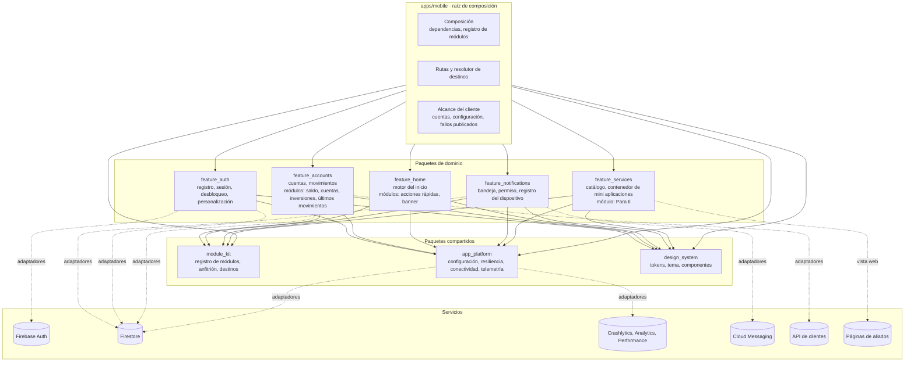
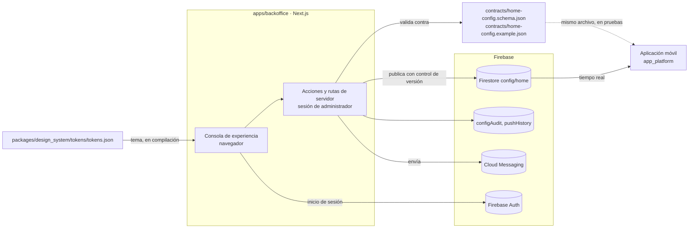
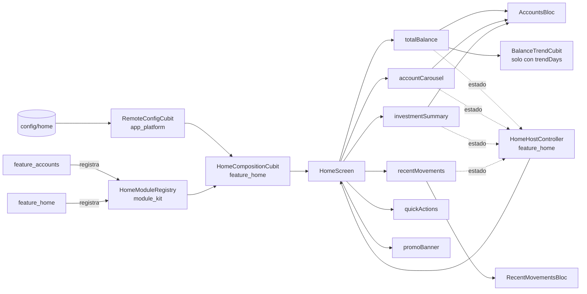

# Componentes y dependencias

Qué paquetes forman la solución, de qué depende cada uno y por qué las flechas van en ese sentido. Describe todo lo construido: la aplicación móvil con sus ocho paquetes y el servidor Next.js con la consola, la API de clientes y las páginas de los aliados simulados. Las flechas continuas del primer diagrama son las dependencias declaradas en los `pubspec.yaml`; los flujos entre piezas están en [flujos.md](flujos.md) y [publicar-configuracion.md](publicar-configuracion.md).

## Paquetes

`module_kit` no depende en ejecución de ningún otro paquete del repositorio: es el contrato y solo necesita el framework. Su `pubspec.yaml` nombra `app_platform` únicamente como dependencia de desarrollo, para la prueba que vigila esa frontera. `feature_auth` es el único dominio que no usa `module_kit`, porque no aporta módulos al inicio.

Ningún paquete de dominio depende de otro. Notificaciones y servicios llegan al inicio sin que el inicio los conozca: la campana ocupa un hueco del encabezado que coloca la raíz de composición, y «Para ti» es un módulo que `feature_services` registra. Un aviso tocado y una acción del inicio usan el mismo resolutor de destinos, de modo que ambos abren lo mismo, mini aplicaciones incluidas.

## La consola y el contrato

La consola y la aplicación no comparten código. Comparten dos archivos: el esquema del contrato, que la consola usa para validar lo que publica y las pruebas de la aplicación para comprobar que su analizador lo lee, y los tokens del sistema de diseño.

## Reglas que el diagrama expresa

| Regla | Cómo se garantiza |
|---|---|
| Un dominio no importa a otro dominio | Cada paquete declara sus dependencias en su `pubspec.yaml`; una prueba de arquitectura por paquete lista los paquetes permitidos y falla ante cualquier otro |
| El inicio no conoce los dominios | `feature_home` depende de `module_kit`, no de `feature_accounts`. Dibuja lo que cada dominio registró |
| El contrato no arrastra nada | La prueba de arquitectura de `module_kit` solo permite el framework: ni el sistema de diseño ni la plataforma |
| Firebase y los plugins solo se tocan desde los adaptadores | Las líneas punteadas. El código de dominio y de presentación habla con interfaces; los adaptadores están en una carpeta aparte y solo los importa la raíz de composición |
| El código puro de la plataforma no importa Flutter | Prueba de arquitectura de `app_platform` |
| La raíz de composición es el único lugar que conoce las implementaciones | `apps/mobile/lib/composition.dart` construye repositorios, política, registro de módulos y resolutor de destinos |

## Qué aporta cada paquete al inicio

- El saldo, el carrusel y las inversiones muestran el mismo conjunto de datos, las cuentas, y comparten su estado. Los últimos movimientos tienen el suyo. Por eso una falla del servicio de movimientos deja el saldo y las cuentas en pantalla.
- La tendencia del saldo lee los movimientos del periodo una vez, con el identificador de servicio `movements`. Si esa lectura falla, el saldo se muestra sin la línea.
- Las acciones rápidas y el banner no tienen datos: se dibujan con lo que la configuración publica y preguntan al resolutor de destinos qué pueden abrir.
- Cada módulo informa su estado al `HomeHostController`, que decide si el inicio tiene algo que mostrar, qué módulos no ocupan espacio y cuándo terminó una actualización. La pantalla no decide nada de eso.
- El tipo `serviceRecommendations` aparece en la configuración publicada y ningún paquete lo registra todavía. El inicio lo omite.

La decisión y sus alternativas están en el [ADR 0013](../adr/0013-registro-de-modulos-y-motor-del-inicio.md).
