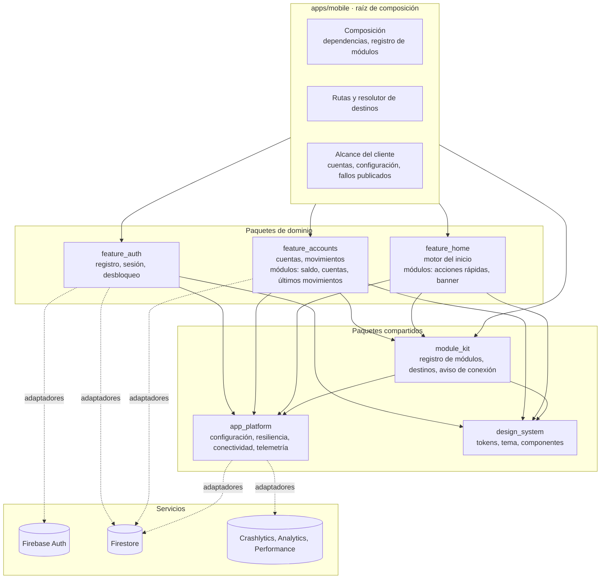
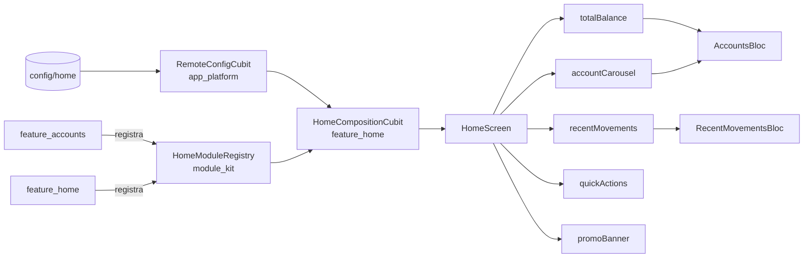

# Componentes y dependencias

Qué paquetes forman la aplicación móvil, de qué depende cada uno y por qué las flechas van en ese sentido. Describe lo construido hasta la etapa 6. La consola web, la API de servidor y los dominios de transferencias, notificaciones y servicios se añadirán en sus etapas.

## Paquetes

## Reglas que el diagrama expresa

| Regla | Cómo se garantiza |
|---|---|
| Un dominio no importa a otro dominio | Cada paquete declara sus dependencias en su `pubspec.yaml`; una prueba de arquitectura por paquete lista los paquetes permitidos y falla ante cualquier otro |
| El inicio no conoce los dominios | `feature_home` depende de `module_kit`, no de `feature_accounts`. Dibuja lo que cada dominio registró |
| Firebase y los plugins solo se tocan desde los adaptadores | Las líneas punteadas. El código de dominio y de presentación habla con interfaces; los adaptadores están en una carpeta aparte y solo los importa la raíz de composición |
| El código puro de la plataforma no importa Flutter | Prueba de arquitectura de `app_platform` |
| La raíz de composición es el único lugar que conoce las implementaciones | `apps/mobile/lib/composition.dart` construye repositorios, política, registro de módulos y resolutor de destinos |

## Qué aporta cada paquete al inicio

- El saldo y el carrusel muestran el mismo conjunto de datos, las cuentas, y comparten su estado. Los últimos movimientos tienen el suyo. Por eso una falla del servicio de movimientos deja el saldo y las cuentas en pantalla.
- Las acciones rápidas y el banner no tienen datos: se dibujan con lo que la configuración publica y preguntan al resolutor de destinos qué pueden abrir.
- Los tipos `investmentSummary` y `serviceRecommendations` aparecen en la configuración publicada y ningún paquete los registra todavía. El inicio los omite.

La decisión y sus alternativas están en el [ADR 0013](../adr/0013-registro-de-modulos-y-motor-del-inicio.md).
