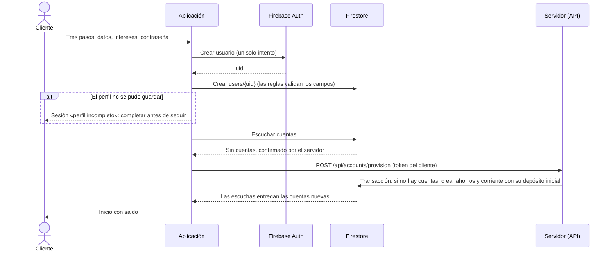
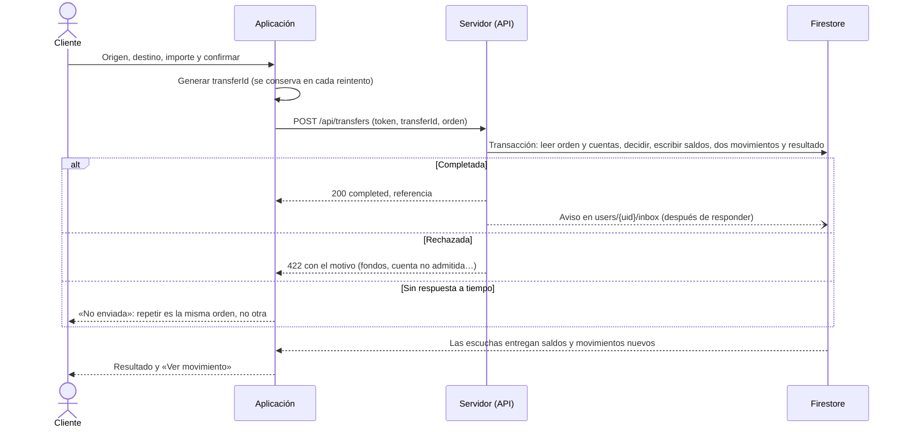
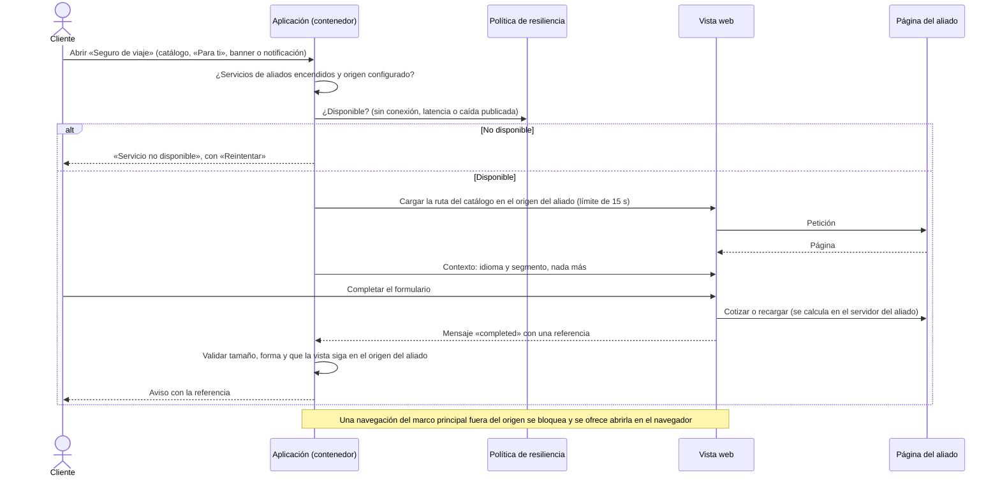

# Flujos principales

Cinco recorridos entre la aplicación, Firebase y el servidor. El sexto, publicar la configuración y recomponer el inicio, tiene su propio documento: [publicar-configuracion.md](publicar-configuracion.md). Las dependencias entre paquetes están en [componentes.md](componentes.md).

En todos, «Servidor» es la aplicación Next.js de `apps/backoffice`, que hoy reúne la consola, la API de clientes y las páginas de los aliados simulados.

## 1. Registro y alta de cuentas

El cliente escribe su propio perfil; las cuentas las abre el servidor. Decisiones: [ADR 0011](../adr/0011-autenticacion-y-perfil.md) y [ADR 0016](../adr/0016-movimiento-de-dinero-en-el-servidor.md).



Llamar otra vez a `provision` no crea nada: devuelve las cuentas que ya existen.

## 2. Transferencia con conexión

El identificador de la orden lo genera la aplicación una vez y es la clave de idempotencia. Decisiones: [ADR 0016](../adr/0016-movimiento-de-dinero-en-el-servidor.md) y [ADR 0017](../adr/0017-transferencias-en-la-aplicacion.md).



Una orden cuya petición pudo salir del teléfono nunca pasa a la cola: solo puede repetirse con el mismo identificador, y el servidor responde con el resultado ya registrado.

## 3. Transferencia en cola, sin conexión

```mermaid
sequenceDiagram
  actor C as Cliente
  participant A as Aplicación
  participant F as Firestore
  participant S as Servidor (API)

  Note over A: Sin conexión conocida antes de enviar nada
  C->>A: Confirmar la transferencia
  A->>F: Crear users/{uid}/transfers/{id} en estado «pending» (queda en la cola local de escritura)
  A-->>C: «Transferencia pendiente», etiqueta «En cola»
  Note over A,F: Vuelve la conexión (o la aplicación se abre de nuevo)
  F-->>F: La escritura llega; las reglas admiten solo una orden pendiente bien formada
  A->>S: POST /api/transfers/{id}/process
  S->>F: Transacción: liquidar o rechazar, una sola vez
  S-->>A: Resultado
  A-->>C: Movimiento en la cuenta, o aviso con el motivo del rechazo
  alt Las reglas rechazan la escritura en cola
    A->>S: Preguntar qué fue de esa orden
    A-->>C: Aviso: no se pudo enviar
  end
```

El procesador de salida recorre las órdenes pendientes de una en una, al recuperar la conexión y al arrancar. Procesar dos veces la misma orden no mueve dinero dos veces.

## 4. Notificación con bandeja

La bandeja la escribe el servidor; el push solo la anuncia. Decisión: [ADR 0018](../adr/0018-notificaciones-y-bandeja.md).

```mermaid
sequenceDiagram
  actor Ad as Administrador
  participant S as Servidor (consola)
  participant F as Firestore
  participant M as Cloud Messaging
  participant A as Aplicación
  actor C as Cliente

  Note over A,F: Antes: el cliente aceptó la invitación y el permiso, y la aplicación guardó users/{uid}/devices/{id} y se suscribió a segment-‹segmento›
  Ad->>S: Título, mensaje, audiencia y destino
  alt Entrega activada (PUSH_DELIVERY=live)
    S->>M: Enviar al tema del segmento o a los dispositivos del cliente
    S->>F: Un documento por destinatario en users/{uid}/inbox
    M-->>A: Notificación del sistema (texto oculto con el teléfono bloqueado)
  else Modo de prueba
    S->>M: Validar sin entregar
    Note over S: Estado «Validado»; no se escribe la bandeja
  end
  S->>F: Registro en el historial de envíos
  C->>A: Tocar la notificación o abrir la bandeja
  A->>A: Resolver el destino contra los destinos conocidos; si no existe o está apagado, abrir la bandeja
  A->>F: Marcar como leída (único cambio que las reglas permiten)
```

Si la sesión está bloqueada o no hay sesión, la notificación tocada espera y se abre cuando el cliente entra; si esa sesión termina antes, se descarta.

## 5. Mini aplicación de un aliado

El origen del aliado se fija al compilar, nunca desde la configuración publicada. Decisión: [ADR 0019](../adr/0019-mini-aplicaciones-de-aliados.md).



Cada carga usa su propia vista web: lo que responda tarde una carga abandonada no cambia la pantalla.
