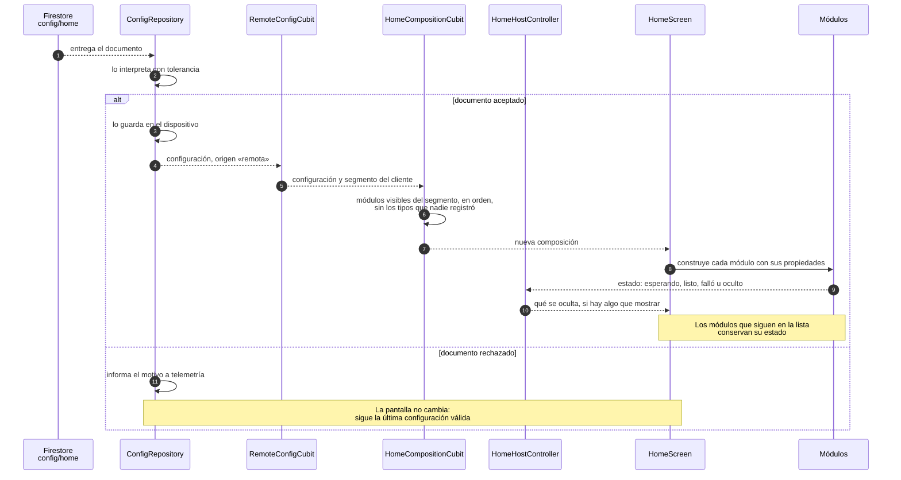

# Flujo: publicar la configuración y recomponer el inicio

Qué ocurre desde que un administrador cambia algo en la consola hasta que la pantalla de inicio de un cliente cambia, sin publicar la aplicación ni reiniciarla. Describe lo construido en las etapas 6 y 7. Una herramienta de desarrollo (`firebase/seed/publish-config.mjs`) publica el mismo documento desde una terminal y sigue el mismo camino a partir del paso 5.

## De la consola al teléfono

```mermaid
sequenceDiagram
  autonumber
  actor A as Administrador
  participant U as Consola<br/>(navegador)
  participant S as Consola<br/>(servidor)
  participant F as Firestore<br/>config/home
  participant R as ConfigRepository<br/>(teléfono)
  participant H as Inicio<br/>(teléfono)

  A->>U: reordena un módulo
  U->>U: borrador: «1 cambio sin publicar»,<br/>vista previa actualizada
  A->>U: Publicar cambios
  U->>S: borrador y versión con la que se cargó
  S->>S: comprueba la sesión de administrador
  S->>S: valida el borrador contra el esquema del contrato
  alt borrador válido
    S->>F: transacción: si la versión guardada es la esperada,<br/>escribe el documento con la versión siguiente<br/>y el registro de auditoría
    alt la versión guardada cambió
      F-->>S: versión distinta
      S-->>U: conflicto: nada se escribió
      Note over U: Publicar queda bloqueado hasta recargar
    else sin conflicto
      F-->>S: escrito
      S-->>U: «Configuración vN publicada»
      F-->>R: entrega el documento (escucha en tiempo real)
      R->>R: lo interpreta con tolerancia y lo guarda
      R-->>H: configuración, origen «publicada»
      H->>H: recompone: mismos módulos, nuevo orden
    end
  else borrador inválido
    S-->>U: motivo; el borrador se conserva
  end
```

## Dentro de la aplicación



## Qué decide cada paso

| Paso | Decisión | Dónde |
|---|---|---|
| Validar en el servidor | La consola valida contra el mismo archivo de esquema que usan las pruebas de la aplicación, no contra una copia de sus reglas | `apps/backoffice`, [ADR 0014](../adr/0014-consola-de-experiencia.md) |
| Escribir con control de versión | La versión nueva sale de la guardada, nunca del navegador. Si otro administrador publicó entretanto, no se escribe nada | [ADR 0014](../adr/0014-consola-de-experiencia.md) |
| Escuchar | La aplicación escucha el documento solo mientras hay una sesión iniciada: leerlo exige estar autenticado. Deja de escuchar antes de cerrar la sesión | `apps/mobile/lib/shell/customer_scope.dart` |
| Interpretar | Campos desconocidos se ignoran, los que faltan toman su valor por defecto, un módulo mal formado se omite, un destino fuera de la lista del documento se elimina y lo que supera los límites de tamaño se recorta. Una versión de esquema más nueva rechaza el documento entero | `HomeConfigParser`, [ADR 0008](../adr/0008-contrato-de-configuracion.md) |
| Guardar | Se guarda el documento tal como llegó, para que una versión futura de la aplicación pueda leer lo que esta ignora | `ConfigRepository` |
| Aplicar | El último documento publicado manda, aunque su número de versión sea menor | [ADR 0008](../adr/0008-contrato-de-configuracion.md) |
| Componer | Un tipo de módulo que esta versión no registra se omite y se informa una vez | `composeHome`, [ADR 0013](../adr/0013-registro-de-modulos-y-motor-del-inicio.md) |
| Dibujar | Cada módulo lee sus propiedades con tolerancia y solo ofrece las acciones cuyo destino la aplicación puede abrir. Uno que no tiene nada que dibujar lo informa y no ocupa espacio | Cada paquete de dominio |

## Al abrir la aplicación

La configuración en uso sale, por este orden, de la copia guardada en el dispositivo, del documento incluido en la aplicación o de una configuración mínima escrita en el código. Con cualquiera de ellas el inicio se dibuja de inmediato, también sin conexión; cuando llega el documento publicado, se recompone.


## El mismo camino lleva el segmento y los fallos del laboratorio

- **Segmento.** La composición depende del documento y del segmento del cliente. Cuando el cliente cambia su segmento en Perfil, en «Personalización», el perfil se guarda y el inicio se recompone con la lista del segmento nuevo, sin iniciar sesión de nuevo.
- **Fallos simulados.** El bloque `resilience` viaja en el mismo documento. Cuando la configuración en uso cambia, la aplicación entrega esos fallos a la política de resiliencia, que los aplica solo en una compilación hecha con `--dart-define=ALLOW_FAULT_INJECTION=true`. Lo que ya está escuchando reacciona en ese momento: falla al publicarse el fallo y se recupera al retirarse. El detalle está en [conectividad degradada](../operacion/conectividad-degradada.md#laboratorio-de-resiliencia).

## Qué se comprobó

En un teléfono Android (ALI-NX3), con el cliente de prueba y el proyecto real:

- **De la consola al teléfono.** Con la consola ejecutándose en local y el inicio abierto en el teléfono, se bajó «Saldo total» una posición en la consola y se publicó. La consola pasó de la versión 31 a la 32 y, sin tocar el teléfono, las cuentas pasaron a dibujarse encima del saldo. El diagnóstico de Perfil mostró «v32 · publicada».
- **Desde la herramienta de desarrollo.** Un documento con otro orden y un módulo oculto cambió la pantalla sin reiniciar la aplicación.
- **Cambio de segmento.** De Familia a Patrimonio desde «Personalización»: el inicio pasó a mostrar el saldo con las inversiones, la línea de tendencia y el módulo de inversiones. Después, a Estoy empezando.

El rechazo de un documento inválido y el conflicto de versión visto desde el teléfono están cubiertos por pruebas automáticas y no se provocaron en el teléfono. El conflicto de versión en la consola se comprobó contra el proyecto real al construirla.
