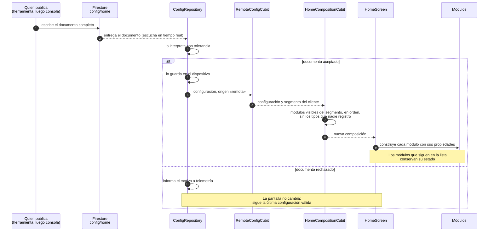
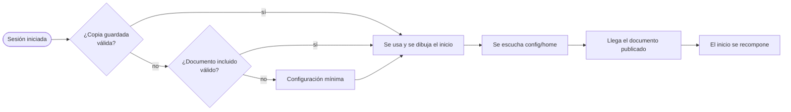

# Flujo: publicar la configuración y recomponer el inicio

Qué ocurre desde que se publica un documento hasta que la pantalla de inicio de un cliente cambia, sin publicar la aplicación ni reiniciarla. Describe lo construido en la etapa 6. Hoy publica una herramienta de desarrollo; la consola web la sustituirá en la etapa 7 sin cambiar el resto del flujo.

## Secuencia

## Qué decide cada paso

| Paso | Decisión | Dónde |
|---|---|---|
| 2 | La aplicación escucha el documento solo mientras hay una sesión iniciada: leerlo exige estar autenticado | `apps/mobile/lib/shell/customer_scope.dart` |
| 3 | Campos desconocidos se ignoran, los que faltan toman su valor por defecto, un módulo mal formado se omite y un destino fuera de la lista cerrada se elimina. Una versión de esquema más nueva rechaza el documento entero | `HomeConfigParser`, [ADR 0008](../adr/0008-contrato-de-configuracion.md) |
| 4 | Se guarda el documento tal como llegó, para que una versión futura de la aplicación pueda leer lo que esta ignora | `ConfigRepository` |
| 5 | El último documento publicado manda, aunque su número de versión sea menor | [ADR 0008](../adr/0008-contrato-de-configuracion.md) |
| 7 | Un tipo de módulo que esta versión no registra se omite y se informa una vez | `composeHome`, [ADR 0013](../adr/0013-registro-de-modulos-y-motor-del-inicio.md) |
| 9 | Cada módulo lee sus propiedades con tolerancia y solo ofrece las acciones cuyo destino la aplicación puede abrir | Cada paquete de dominio |

## Al abrir la aplicación

La configuración en uso sale, por este orden, de la copia guardada en el dispositivo, del documento incluido en la aplicación o de una configuración mínima escrita en el código. Con cualquiera de ellas el inicio se dibuja de inmediato, también sin conexión; cuando llega el documento publicado, se recompone.

## El mismo camino lleva los fallos del laboratorio

El bloque `resilience` viaja en el mismo documento. Cuando la configuración en uso cambia, la aplicación entrega esos fallos a la política de resiliencia, que los aplica solo en una compilación hecha con `--dart-define=ALLOW_FAULT_INJECTION=true`. El detalle y lo que se comprobó en un teléfono están en [conectividad degradada](../operacion/conectividad-degradada.md#laboratorio-de-resiliencia).

## Qué se comprobó

En un teléfono Android, con el cliente de prueba y el proyecto real: se publicó un documento con otro orden de módulos y uno oculto mientras la aplicación mostraba el inicio, y la pantalla cambió sin reiniciarla. El diagnóstico de Perfil mostró la versión publicada y su origen. El rechazo de un documento inválido y el cambio de segmento están cubiertos por pruebas automáticas y no se provocaron en el teléfono.
