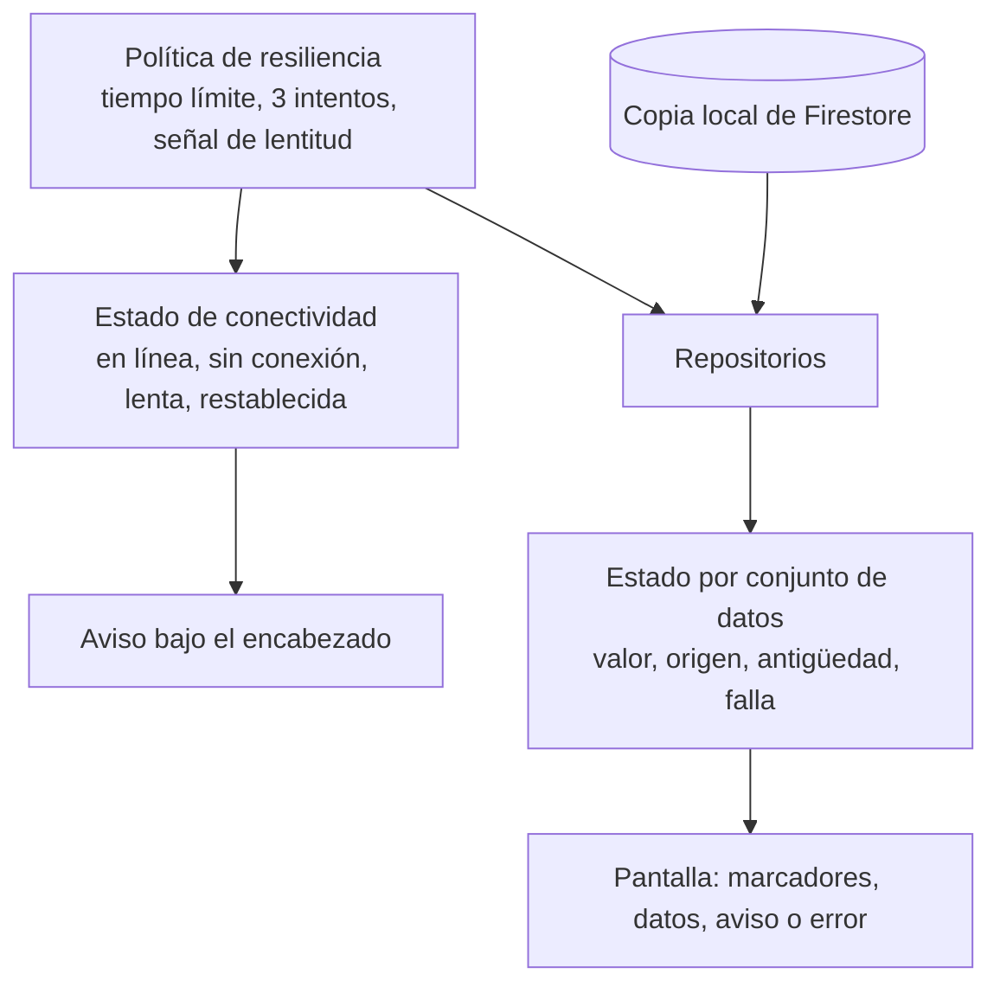

# Comportamiento con conectividad degradada

Qué hace la aplicación cuando la conexión falta, es lenta o un servicio no responde. Primera versión, escrita al cerrar la etapa 5: cubre el acceso y las cuentas y movimientos. El inicio dinámico, las transferencias y los servicios de aliados añadirán sus apartados en sus etapas.

Cada apartado separa lo **implementado y visto en un dispositivo**, lo **implementado y cubierto solo por pruebas automáticas** y lo **planificado**. Las decisiones están en el [ADR 0009](../adr/0009-politica-de-resiliencia.md) (política de resiliencia) y el [ADR 0012](../adr/0012-lectura-de-cuentas-y-movimientos.md) (lectura y caché).

## Principios

1. **Lo que ya se pudo mostrar no se quita.** Una falla al actualizar deja en pantalla los últimos datos, con su antigüedad.
2. **El cliente sabe qué está viendo.** Datos confirmados por el servidor no llevan marca; datos guardados dicen desde cuándo.
3. **Una parte que falla no arrastra a las demás.** Cada conjunto de datos tiene su propio estado: los movimientos pueden fallar con el saldo en pantalla.
4. **Los reintentos automáticos tienen límite, y solo se reintenta lo que es seguro repetir.** Tres intentos para lecturas; un solo intento para todo lo que cambia algo.
5. **Nunca se afirma algo que no se sabe.** Un dispositivo sin datos guardados no dice «no tienes cuentas»; dice que no pudo conectarse.

## Piezas

- **Estado de conectividad** (`ConnectivityCubit`): uno para toda la aplicación. Combina si el dispositivo tiene red con si las peticiones están tardando.
- **Política de resiliencia** (`ResiliencePolicy`): por dónde pasa cada llamada a un servicio. Tiempo límite de 8 s por intento, hasta 3 intentos con espera creciente, y una señal de lentitud a los 3 s. Los umbrales se eligieron sin mediciones.
- **Copia local**: la persistencia del SDK de Firestore. Guarda lo que el dispositivo ya leyó.
- **Estado por conjunto de datos** (`LoadState`): el último valor, de dónde vino, de cuándo es, y si actualizarlo está en curso o falló.

## Sin conexión

| Situación | Qué ve el cliente | Estado |
|---|---|---|
| Cuentas o movimientos ya vistos antes | Aviso «Sin conexión. Mostrando datos guardados», los datos y «Actualizado hace N min» | Visto en un teléfono, también tras cerrar y abrir la aplicación en modo avión |
| Cuentas o movimientos nunca vistos en este dispositivo | Aviso «Sin conexión», el mensaje «No pudimos conectarnos. Revisa tu conexión e intenta de nuevo.» y «Reintentar» | Pruebas automáticas |
| Sesión ya iniciada, al abrir la aplicación | La sesión se restaura y el cliente entra | Visto en un teléfono |
| Formularios de inicio de sesión y registro | Aviso «Sin conexión. Revisa tu red e intenta de nuevo» en el formulario | Visto en un emulador (etapa 4) |
| Filtrar y buscar movimientos | Funcionan: trabajan sobre lo ya cargado | Pruebas automáticas |
| Pedir más movimientos | Se muestran los que el dispositivo tenga guardados | Sin verificar |

Sin conexión no se intenta la llamada: la política responde de inmediato con una falla de tipo «sin conexión», y no hay reintentos que esperar.

## Recuperación

| Situación | Qué ocurre | Estado |
|---|---|---|
| Vuelve la conexión con una pantalla de cuentas o movimientos abierta | Aviso «Conexión restablecida. Datos actualizados» durante unos segundos; las escuchas se resincronizan solas, los datos pasan a estar confirmados y desaparece la antigüedad | Visto en un teléfono |
| El cliente toca «Reintentar» | El error permanece en pantalla con indicación de progreso hasta que hay respuesta | Pruebas automáticas |
| El cliente desliza hacia abajo | Se vuelve a preguntar al servidor por cuentas y movimientos | Pruebas automáticas |

La recuperación no depende de que el cliente haga algo: la escucha de Firestore vuelve a conectarse por su cuenta, y un dato confirmado borra la falla anterior.

## Alta latencia

| Situación | Qué ve el cliente | Estado |
|---|---|---|
| Una petición tarda más de 3 s | Aviso «Conexión lenta. Seguimos intentando», con una línea de progreso | Pruebas automáticas |
| Hay datos guardados y el servidor tarda | Los datos guardados se muestran de inmediato, con su antigüedad, mientras llega la respuesta | Pruebas automáticas |
| No hay datos guardados y el servidor tarda | Marcadores con la forma del contenido | Pruebas automáticas |
| Se agotan los tres intentos | Con datos guardados: los datos y un aviso con «Reintentar». Sin datos: «No pudimos conectarnos. Lo intentamos 3 veces sin éxito.» | Pruebas automáticas |

El peor caso de una lectura que nunca responde ronda los 25 s (tres intentos de 8 s más las esperas). Durante ese tiempo el cliente ve datos guardados si existen. No hay cancelación desde la interfaz; es un límite conocido del [ADR 0009](../adr/0009-politica-de-resiliencia.md).

## Indisponibilidad parcial

| Situación | Qué ve el cliente | Estado |
|---|---|---|
| Los movimientos fallan y las cuentas responden | El saldo y los datos de la cuenta en pantalla; en el lugar de los movimientos, «No pudimos cargar tus movimientos» con «Reintentar» | Pruebas automáticas |
| Las cuentas fallan y nunca se vieron | Mensaje de error a pantalla completa con «Reintentar» | Pruebas automáticas |
| Un documento con un formato que la aplicación no entiende | Ese elemento se omite; el resto se muestra | Pruebas automáticas |
| Una categoría, un canal o un estado desconocidos | El movimiento se muestra como «Otros» o «Pendiente» | Pruebas automáticas |

Cuentas y movimientos se identifican como servicios distintos (`accounts` y `movements`) ante la política de resiliencia, de modo que el laboratorio de resiliencia de la consola podrá desactivar los movimientos sin tocar las cuentas.

## Qué no está hecho

- **La demostración en vivo de latencia y caída parcial.** La inyección de fallos existe en la política y solo actúa en compilaciones con `ALLOW_FAULT_INJECTION`, pero la aplicación todavía no escucha la configuración publicada que la activa (etapa 6) ni existe la consola que la publica (etapa 7). Hoy esos dos escenarios solo están cubiertos por pruebas automáticas.
- **Transferencias sin conexión.** La cola con identificador de idempotencia llega con la etapa 8.
- **Micro aplicativos de aliados no disponibles.** Etapa 10.
- **El contador «Intento 2 de 3» del diseño.** La pantalla indica que está reintentando y, al terminar, cuántos intentos hubo.
- **Detección de falta de salida real a internet.** El estado de conectividad dice si el dispositivo tiene una interfaz de red activa, no si esa red llega a internet (un portal cautivo, por ejemplo). En ese caso las peticiones agotan su tiempo y se muestran como una falla, no como «sin conexión».
- **Borrado de los datos guardados al cerrar sesión.** La copia local permanece en el dispositivo.
- **iOS.** Nada de lo anterior se ha ejecutado en iOS.
