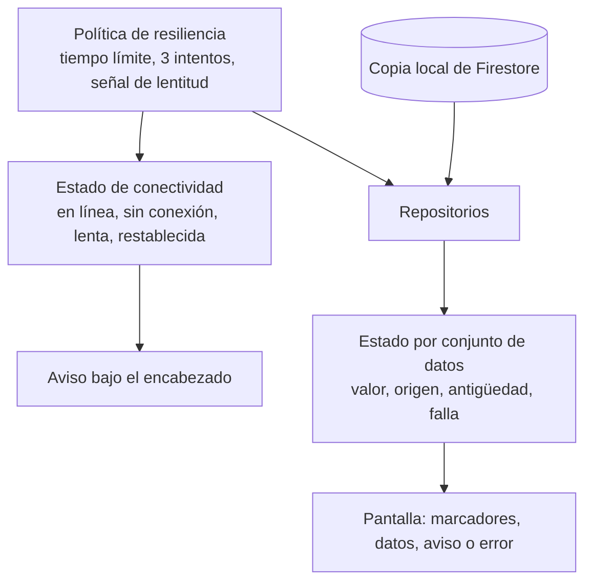
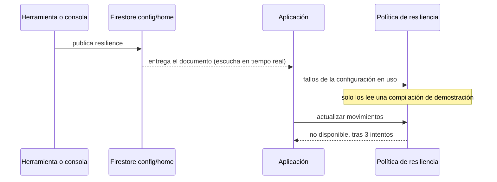

# Comportamiento con conectividad degradada

Qué hace la aplicación cuando la conexión falta, es lenta o un servicio no responde. Actualizado al cerrar la etapa 6: cubre el acceso, las cuentas y movimientos y el inicio. Las transferencias y los servicios de aliados añadirán sus apartados en sus etapas.

Cada apartado separa lo **implementado y visto en un dispositivo**, lo **implementado y cubierto solo por pruebas automáticas** y lo **planificado**. Las decisiones están en el [ADR 0009](../adr/0009-politica-de-resiliencia.md) (política de resiliencia), el [ADR 0012](../adr/0012-lectura-de-cuentas-y-movimientos.md) (lectura y caché) y el [ADR 0013](../adr/0013-registro-de-modulos-y-motor-del-inicio.md) (un estado por módulo del inicio).

## Principios

1. **Lo que ya se pudo mostrar no se quita.** Una falla al actualizar deja en pantalla los últimos datos, con su antigüedad.
2. **El cliente sabe qué está viendo.** Datos confirmados por el servidor no llevan marca; datos guardados dicen desde cuándo.
3. **Una parte que falla no arrastra a las demás.** Cada conjunto de datos tiene su propio estado: los movimientos pueden fallar con el saldo en pantalla.
4. **Los reintentos automáticos tienen límite, y solo se reintenta lo que es seguro repetir.** Tres intentos para lecturas; un solo intento para todo lo que cambia algo.
5. **Nunca se afirma algo que no se sabe.** Un dispositivo sin datos guardados no dice «no tienes cuentas»; dice que no pudo conectarse.

## Piezas

- **Estado de conectividad** (`ConnectivityCubit`): uno para toda la aplicación. Combina si el dispositivo tiene red con si las peticiones están tardando.
- **Política de resiliencia** (`ResiliencePolicy`): por dónde pasa cada llamada a un servicio. Tiempo límite de 8 s por intento, hasta 3 intentos con espera creciente, y una señal de lentitud a los 3 s. Los umbrales se eligieron sin mediciones.
- **Copia local**: la persistencia del SDK de Firestore. Guarda lo que el dispositivo ya leyó.
- **Estado por conjunto de datos** (`LoadState`): el último valor, de dónde vino, de cuándo es, y si actualizarlo está en curso o falló.

## Sin conexión

| Situación | Qué ve el cliente | Estado |
|---|---|---|
| Cuentas o movimientos ya vistos antes | Aviso «Sin conexión. Mostrando datos guardados», los datos y «Actualizado hace N min» | Visto en un teléfono, también tras cerrar y abrir la aplicación en modo avión |
| Cuentas o movimientos nunca vistos en este dispositivo | Aviso «Sin conexión», el mensaje «No pudimos conectarnos. Revisa tu conexión e intenta de nuevo.» y «Reintentar» | Pruebas automáticas |
| Inicio, con la aplicación abierta o al abrirla sin conexión | El mismo aviso; el inicio se arma con la última configuración guardada y cada módulo con datos muestra los suyos con «Actualizado hace N min». Las acciones rápidas y el banner, que no tienen datos, no llevan antigüedad | Visto en un teléfono, en modo avión y abriendo la aplicación en modo avión |
| Sesión ya iniciada, al abrir la aplicación | La sesión se restaura y el cliente entra | Visto en un teléfono |
| Después de cerrar sesión | No queda nada guardado del cliente: la copia local y las horas de sincronización se borran al terminar la sesión. Iniciar sesión exige conexión | Visto en un teléfono: tras cerrar sesión no quedan archivos de la base local ni horas de sincronización, y volver a iniciar sesión carga los datos del servidor |
| Formularios de inicio de sesión y registro | Aviso «Sin conexión. Revisa tu red e intenta de nuevo» en el formulario | Visto en un emulador (etapa 4) |
| Filtrar y buscar movimientos | Funcionan: trabajan sobre lo ya cargado | Pruebas automáticas |
| Pedir más movimientos | Se muestran los que el dispositivo tenga guardados | Sin verificar |

Sin conexión no se intenta la llamada: la política responde de inmediato con una falla de tipo «sin conexión», y no hay reintentos que esperar.

## Recuperación

| Situación | Qué ocurre | Estado |
|---|---|---|
| Vuelve la conexión con una pantalla de cuentas o movimientos abierta | Aviso «Conexión restablecida. Datos actualizados» durante unos segundos; las escuchas se resincronizan solas, los datos pasan a estar confirmados y desaparece la antigüedad | Visto en un teléfono |
| El cliente toca «Reintentar» | El error permanece en pantalla con indicación de progreso hasta que hay respuesta | Pruebas automáticas |
| El cliente desliza hacia abajo | Se vuelve a preguntar al servidor por cuentas y movimientos. En el inicio, cada módulo con datos se actualiza y el indicador espera a todos | Visto en un teléfono en el inicio; pruebas automáticas en las demás pantallas |
| Vuelve la conexión con el inicio abierto | El aviso «Conexión restablecida. Datos actualizados» y los módulos pasan a datos confirmados | Visto en un teléfono |

Hay dos casos distintos:

- **Se pierde la red y vuelve.** La recuperación no depende de que el cliente haga algo: la escucha de Firestore vuelve a conectarse por su cuenta, y un dato confirmado borra la falla anterior.
- **La escucha termina con un error** (un permiso denegado, por ejemplo). Firestore no la reanuda: deja de entregar cambios. La pantalla muestra la falla, se emite `accounts_data_load_failed`, y cuando el cliente toca «Reintentar» o desliza para actualizar la aplicación crea una escucha nueva antes de preguntar al servidor. Sin ese paso los datos se actualizarían una vez y quedarían congelados. Está cubierto por pruebas automáticas; no se ha provocado en un dispositivo.

## Alta latencia

| Situación | Qué ve el cliente | Estado |
|---|---|---|
| Una petición tarda más de 3 s | Aviso «Conexión lenta. Seguimos intentando», con una línea de progreso, que desaparece cuando llega la respuesta | Visto en un teléfono, con 5 s de latencia publicados desde la configuración |
| Hay datos guardados y el servidor tarda | Los datos guardados se muestran de inmediato, con su antigüedad, mientras llega la respuesta | Pruebas automáticas |
| No hay datos guardados y el servidor tarda | Marcadores con la forma del contenido | Pruebas automáticas |
| Se agotan los tres intentos | Con datos guardados: los datos y un aviso con «Reintentar». Sin datos: «No pudimos conectarnos. Lo intentamos 3 veces sin éxito.» | Pruebas automáticas |

El peor caso de una lectura que nunca responde ronda los 25 s (tres intentos de 8 s más las esperas). Durante ese tiempo el cliente ve datos guardados si existen. No hay cancelación desde la interfaz; es un límite conocido del [ADR 0009](../adr/0009-politica-de-resiliencia.md).

## Indisponibilidad parcial

| Situación | Qué ve el cliente | Estado |
|---|---|---|
| Los movimientos fallan y las cuentas responden, sin movimientos en pantalla | El saldo y las cuentas en pantalla; en el lugar de los movimientos, «No pudimos cargar tus movimientos» con «Reintentar» | Visto en un teléfono en el inicio, abriendo la aplicación con el servicio dado por caído; pruebas automáticas en el detalle de una cuenta |
| Los movimientos fallan con movimientos ya en pantalla | Los movimientos se conservan, con el aviso «No pudimos actualizar tus movimientos. Mostramos los últimos datos guardados.» y «Reintentar» | Visto en un teléfono en el inicio |
| El servicio de movimientos vuelve | El módulo se recupera solo, con lo último que la escucha recibió; «Reintentar» también crea de nuevo la escucha y pregunta al servidor | Visto en un teléfono: al retirar el fallo publicado, los movimientos volvieron sin tocar nada |
| Los módulos con datos fallan y hay módulos sin datos (acciones rápidas, banner) | Los módulos sin datos siguen en pantalla y el que falló muestra su error con «Reintentar» | Visto en un teléfono, con un inicio de acciones rápidas, banner y movimientos y el servicio de movimientos caído |
| Todo lo que dibujaría algo es un módulo con datos que falló | Un único mensaje para toda la pantalla, «No pudimos conectarnos», con un «Reintentar» que actualiza todos los módulos. El inicio vuelve en cuanto uno tiene datos | Pruebas automáticas |
| Las cuentas fallan y el saldo no está publicado en ese inicio | El carrusel, o las inversiones, muestran su propio error con «Reintentar» en lugar de quedar en blanco | Pruebas automáticas |
| Un módulo tarda en actualizarse más de 30 s, o falla al hacerlo | Los demás terminan, el indicador desaparece y la siguiente actualización funciona | Pruebas automáticas |
| No se pueden leer los movimientos del periodo de la tendencia | El saldo se muestra sin la línea de tendencia | Pruebas automáticas |
| La configuración publica un tipo de módulo que esta versión no conoce | Se omite y el resto del inicio se dibuja | Visto en un teléfono: el segmento del cliente de prueba publica un módulo de servicios recomendados que aún no existe |
| Las cuentas fallan y nunca se vieron | Mensaje de error a pantalla completa con «Reintentar» | Pruebas automáticas |
| Un documento con un formato que la aplicación no entiende | Ese elemento se omite; el resto se muestra | Pruebas automáticas |
| Una categoría, un canal o un estado desconocidos | El movimiento se muestra como «Otros» o «Pendiente» | Pruebas automáticas |

Cuentas y movimientos se identifican como servicios distintos (`accounts` y `movements`) ante la política de resiliencia, y en el inicio cada uno tiene su propio estado: el saldo, el carrusel y las inversiones leen las cuentas, y los últimos movimientos tienen un Bloc aparte. El inicio solo sustituye la pantalla por un error cuando todo lo que dibujaría algo es un módulo con datos que falló; basta un módulo sano para que siga en pantalla.

## Transferencias

La regla que ordena todo: una orden solo se deja en cola cuando es seguro que no salió del teléfono. En cualquier otro caso, el cliente repite la misma orden con el mismo identificador, que el servidor liquida una sola vez ([ADR 0017](../adr/0017-transferencias-en-la-aplicacion.md)).

| Situación | Qué ve el cliente | Estado |
| --- | --- | --- |
| Transferencia con conexión | «Transferencia realizada» con su referencia, y el movimiento en las dos cuentas | Visto en un teléfono, con la prueba de extremo a extremo |
| Monto por encima del máximo por transferencia | El error bajo el monto y no se puede continuar | Visto en un teléfono |
| Monto por encima del saldo disponible | «Saldo insuficiente. Disponible: …» bajo el monto | Pruebas automáticas |
| Sin conexión al confirmar | «Transferencia pendiente», etiqueta «En cola», sin «Ver movimiento». La orden queda en el teléfono | Pruebas automáticas |
| Vuelve la conexión con órdenes en cola | Se envían solas, de una en una. Cada movimiento aparece en su cuenta | Pruebas automáticas |
| Se cierra y se abre la aplicación con órdenes en cola | Siguen en cola y se envían al haber conexión | Sin verificar: depende de la persistencia de Firestore en el dispositivo |
| El servidor no contesta a tiempo, o la conexión se pierde con la petición ya enviada | «No pudimos enviar la transferencia» y «Reintentar», que repite la misma orden. Nunca «En cola» | Pruebas automáticas |
| El cliente sale y vuelve a entrar a transferir con esa orden sin resolver | La pantalla se abre sobre esa orden, no sobre un formulario vacío | Pruebas automáticas |
| La petición está en vuelo | No se puede salir de la pantalla: ni con el retroceso del sistema ni con el botón de cerrar | Pruebas automáticas |
| El servidor rechaza la orden | El motivo, sin «Reintentar» | Pruebas automáticas |
| La sesión ya no es válida | Se renueva el token una vez; si no basta, «Tu sesión venció…», sin reintento | Pruebas automáticas |
| El banco no acepta una orden que estaba en cola | Aviso en Cuentas: el motivo del rechazo, o «Una transferencia en cola no se pudo enviar. Revisa tus movimientos antes de repetirla.» | Pruebas automáticas |
| Cerrar sesión con órdenes que solo existen en el teléfono | Aviso de que se descartan; la sesión solo se cierra si el cliente lo confirma | Pruebas automáticas |
| Cerrar sesión con órdenes que el banco ya recibió | Aviso de que no se descartan y se completarán al volver a iniciar sesión | Pruebas automáticas |
| La API de clientes está caída | «No pudimos enviar la transferencia». No se encola: el teléfono tiene conexión y la orden esperaría a un servidor caído | Pruebas automáticas |
| Cliente nuevo sin cuentas | «Estamos preparando tu cuenta» mientras se pide el alta; si falla, el aviso con «Reintentar» | Pruebas automáticas |

Lo marcado como «Pruebas automáticas» no se ha visto en un dispositivo: el teléfono estaba bloqueado cuando se intentó.

## Laboratorio de resiliencia

La configuración publicada lleva un bloque `resilience` con la latencia añadida y los servicios dados por caídos. La aplicación lo aplica en un único lugar, la política de resiliencia, y solo si se compiló con `--dart-define=ALLOW_FAULT_INJECTION=true`.

| Fallo publicado | Efecto | Estado |
|---|---|---|
| Latencia | Cada intento espera ese tiempo antes de consultar. La señal de lentitud y el tiempo límite cuentan esa espera, así que la latencia recorre el mismo camino que una red lenta real | Visto en un teléfono |
| Movimientos no disponibles | Las consultas de movimientos responden «no disponible» y se reintentan como una caída real. La escucha en tiempo real de movimientos deja de entregar datos: una caída que siguiera actualizando la pantalla no sería una caída | Visto en un teléfono |
| Se publica o se retira un fallo con la pantalla abierta | Lo que ya está escuchando reacciona en ese momento, sin esperar a que cambien los datos: falla al publicarse y se recupera al retirarse | Visto en un teléfono, en ambos sentidos, en menos de 5 s |
| Los mismos fallos, en una compilación sin la opción | Ninguno. Los movimientos se mostraron y la actualización respondió sin demora | Visto en un teléfono |
| Al cerrar sesión | Los fallos se retiran: fuera de una sesión no se lee la configuración. La aplicación deja de leer la configuración antes de cerrar la sesión, para que el permiso denegado que sigue no se informe como una falla | Pruebas automáticas |

Quien sigue la configuración avisa a la política cuando los fallos publicados cambian, y la política lo pasa a las escuchas en curso. Las consultas puntuales no necesitan aviso: leen los fallos en cada intento.

Una observación sin explicar: en el primer arranque tras instalar la compilación de demostración, con un fallo de movimientos publicado mientras la aplicación estaba cerrada, el inicio mostró los movimientos sin el aviso durante al menos 14 segundos. No se reprodujo en dos intentos posteriores con los mismos pasos, en los que el aviso apareció en menos de 5 segundos.

## Qué no está hecho

- **Publicar los fallos desde la consola, visto en un dispositivo.** La consola tiene el laboratorio de resiliencia y sus pruebas, pero en el teléfono los fallos se publicaron con la herramienta de desarrollo `firebase/seed/publish-config.mjs`. Desde la consola se comprobó en el teléfono un cambio de orden de módulos.
- **El aviso de conexión como aviso flotante.** El diseño muestra «Conexión restablecida» como un aviso flotante; la aplicación lo muestra como un aviso bajo el encabezado.
- **Transferencias sin conexión.** La cola con identificador de idempotencia llega con la etapa 8.
- **Micro aplicativos de aliados no disponibles.** Etapa 10.
- **El contador «Intento 2 de 3» del diseño.** La pantalla indica que está reintentando y, al terminar, cuántos intentos hubo.
- **Detección de falta de salida real a internet.** El estado de conectividad dice si el dispositivo tiene una interfaz de red activa, no si esa red llega a internet (un portal cautivo, por ejemplo). En ese caso las peticiones agotan su tiempo y se muestran como una falla, no como «sin conexión».
- **iOS.** Nada de lo anterior se ha ejecutado en iOS.
