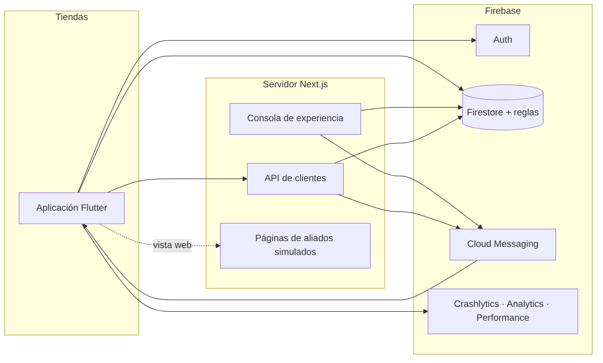
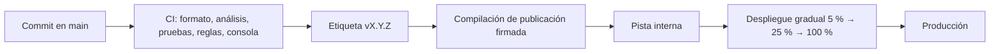

# Estrategia de despliegue y operación

Este documento describe cómo se desplegaría y operaría el sistema. **Nada de lo que sigue se ha ejecutado**: la aplicación no está publicada en ninguna tienda y el servidor no está desplegado. Lo que sí existe hoy es la integración continua, las reglas de Firestore desplegadas en el proyecto de demostración y un modo local reproducible (`tool/local-stack.sh`). La última sección lista lo que falta para producción.

## Piezas que se despliegan

| Pieza | Artefacto | Dónde vive su configuración |
| --- | --- | --- |
| Aplicación | APK/AAB e IPA firmados | `--dart-define` en la compilación y la configuración publicada en `config/home` |
| Servidor (consola, API y aliados) | Aplicación Next.js | Variables de entorno del proveedor ([backoffice.md](backoffice.md), [api.md](api.md)) |
| Reglas e índices de Firestore | `firebase/firestore.rules`, `firebase/firestore.indexes.json` | El repositorio |
| Configuración del inicio | Documento `config/home` | La consola, validada contra `contracts/home-config.schema.json` |

## Entornos

| Entorno | Firebase | Servidor | Aplicación | Fallos simulados | Notificaciones |
| --- | --- | --- | --- | --- | --- |
| Local | Emuladores de Auth y Firestore | `next dev` en el puerto 3210 | Depuración o perfil con `USE_FIREBASE_EMULATORS=true` | Permitidos | Solo validadas, sin salir de la máquina |
| Demostración | Proyecto `flutter-challenge-bi` | Local hoy; preparado para Firebase App Hosting con `BACKOFFICE_ENVIRONMENT=demo` | Perfil con `ALLOW_FAULT_INJECTION=true` | Permitidos | Reales solo con `PUSH_DELIVERY=live` |
| Producción (no existe) | Proyecto propio | Despliegue sin `BACKOFFICE_ENVIRONMENT=demo` | Publicación, sin las opciones de desarrollo | La aplicación los ignora y el servidor rechaza publicarlos | Reales |

Las diferencias entre entornos están en configuración, no en ramas. Tres candados lo sostienen en el código:

- Una compilación de publicación se niega a arrancar con los emuladores, sin una dirección `https` para la API o con un origen `http` para los aliados (`apps/mobile/lib/firebase_emulators.dart`, `api_base_url.dart`, `packages/feature_services`).
- La inyección de fallos solo actúa si la compilación la permite ([ADR 0009](../adr/0009-politica-de-resiliencia.md)).
- El servidor no arranca con variables de emulador en un despliegue, y reconoce un despliegue de dos formas para que ninguna falle sola: `NODE_ENV=production` o la marca que pone la propia plataforma de alojamiento (`K_SERVICE` en Cloud Run y Firebase App Hosting, `VERCEL` en Vercel). Entrega notificaciones solo con `PUSH_DELIVERY=live` ([ADR 0015](../adr/0015-acceso-de-administradores.md), [ADR 0014](../adr/0014-consola-de-experiencia.md)).

## Aplicación móvil: de `main` a la tienda

El repositorio sigue Trunk Based Development ([ADR 0006](../adr/0006-trunk-based-development.md)): `main` siempre es publicable y las versiones salen de él con una etiqueta, sin ramas de versión de larga vida.

1. **Versión.** `version` de `apps/mobile/pubspec.yaml` (hoy `0.1.0+1`). El número de compilación lo pone la canalización; la etiqueta `vX.Y.Z` marca el commit publicado.
2. **Compilación.** `flutter build appbundle --release --dart-define=API_BASE_URL=https://… --dart-define=PARTNER_BASE_URL=https://…`. Sin `ALLOW_FAULT_INJECTION`, `USE_FIREBASE_EMULATORS` ni `PARTNER_DEV_ORIGIN`.
3. **Firma.** Con una clave que vive en el almacén de secretos de la canalización, nunca en el repositorio (`key.properties`, `*.jks` y `*.keystore` están en `.gitignore`). **Hoy no está configurada**: la compilación de publicación usa la clave de depuración de la plantilla.
4. **Despliegue gradual.** Pista interna, después porcentajes crecientes. El criterio para avanzar es el porcentaje de usuarios sin fallos y la tasa de `transfer_stopped` y `config_rejected` frente a la versión anterior ([monitoreo.md](monitoreo.md)).
5. **Símbolos.** Subir los símbolos de depuración a Crashlytics en la misma canalización para que las trazas sean legibles.

### Qué necesita una versión de tienda y qué no

| Cambio | ¿Versión nueva? | Cómo se hace |
| --- | --- | --- |
| Reordenar, ocultar o mostrar módulos del inicio por segmento | No | Publicar desde la consola |
| Texto y destino del banner, acciones rápidas | No | Publicar desde la consola |
| Encender o apagar transferencias o servicios de aliados | No | Interruptores de la configuración |
| Contenido de una mini aplicación de un aliado | No | El aliado despliega su página |
| Un tipo de módulo nuevo | Sí | El dominio lo registra; las versiones anteriores lo omiten sin fallar ([ADR 0013](../adr/0013-registro-de-modulos-y-motor-del-inicio.md)) |
| Un destino o un aliado nuevo, o cambiar el origen de un aliado | Sí | El origen se fija al compilar, por seguridad ([ADR 0019](../adr/0019-mini-aplicaciones-de-aliados.md)) |
| Una versión de esquema de configuración más alta | Sí, antes de publicarla | Las versiones anteriores conservan la última configuración válida ([ADR 0008](../adr/0008-contrato-de-configuracion.md)) |

La configuración publicada es la primera palanca de reversión: apagar una funcionalidad llega a los teléfonos en segundos y no depende de la revisión de una tienda.

## Servidor Next.js

- **Alojamiento.** Firebase App Hosting, que ejecuta Next.js sobre Cloud Run dentro del mismo proyecto de Firebase. Se eligió frente a Vercel por las credenciales: el servidor corre con la identidad de servicio del propio proyecto y no existe ninguna clave de cuenta de servicio que crear, guardar o rotar. El costo es que exige el plan de pago por uso (Blaze). La configuración está en `apps/backoffice/apphosting.yaml`; **el despliegue está preparado y no se ha ejecutado**. Los pasos, en [backoffice.md](backoffice.md#despliegue-en-firebase-app-hosting-preparado-no-realizado).
- **Credenciales.** Las credenciales por defecto de la plataforma. `FIREBASE_SERVICE_ACCOUNT` sigue existiendo para un proveedor sin identidad propia, y entonces solo en su almacén de secretos; nunca en un archivo del repositorio ni en un `.env` compartido.
- **Comprobación de salud.** `GET /api/health` responde sin sesión con la versión y si la configuración es válida, sin revelar ningún valor: 200 o 503.
- **Variables.** `FIREBASE_PROJECT_ID`, `ADMIN_EMAILS`, `PUSH_DELIVERY`, `BACKOFFICE_ENVIRONMENT` y las `NEXT_PUBLIC_FIREBASE_*` de la consola. El servidor comprueba el proyecto al arrancar y falla si no es el esperado.
- **Una sola aplicación hoy, tres mañana.** La consola, la API de clientes y las páginas de aliados comparten despliegue porque así cabían en el alcance del reto. Deberían separarse:
  - la **API de clientes** recibe tráfico de todos los teléfonos y mueve dinero: escala y se limita por separado, detrás de App Check y de límites de frecuencia;
  - la **consola** es una herramienta interna: red restringida o acceso con identidad corporativa;
  - el **contenido de aliados** debe vivir en el origen de cada aliado. Compartir origen con la consola es aceptable solo en la demostración.
- **Canalización.** `.github/workflows/backoffice.yml` ya ejecuta lint, compilación, tipos y pruebas. El despliegue sería un paso posterior en `main`, con promoción manual a producción.

## Reglas e índices de Firestore

Se despliegan desde el repositorio, después de sus pruebas con el emulador (110 casos en `firebase/test`), con `firebase deploy --only firestore:rules,firestore:indexes`. Hoy el despliegue al proyecto de demostración se hizo a mano tras pasar las pruebas; en una canalización sería un trabajo de `main` con una cuenta de servicio de permisos mínimos. Orden cuando un cambio abarca reglas y aplicación: primero las reglas que **permiten** lo nuevo, después la aplicación; para retirar un permiso, al revés.

## Reversión por componente

| Componente | Primera palanca | Tiempo | Reversión completa |
| --- | --- | --- | --- |
| Experiencia del inicio | Publicar la configuración anterior desde la consola (queda en `configAudit`) | Segundos | La misma |
| Una funcionalidad de la aplicación | Apagar su interruptor en la configuración | Segundos | Versión nueva en la tienda |
| Aplicación | Detener el despliegue gradual | Minutos | Versión correctiva; una versión ya instalada no se puede retirar |
| Servidor | Volver al despliegue anterior del proveedor | Minutos | La misma |
| Reglas de Firestore | Desplegar el commit anterior de `firebase/firestore.rules` | Minutos | La misma |
| Datos (saldos, movimientos) | No hay reversión automática | — | Movimientos compensatorios; no existe hoy una herramienta de conciliación |

## Guía ante incidentes

Los tres más probables, con las señales que ya existen en [monitoreo.md](monitoreo.md).

### 1. Se publicó una configuración defectuosa

- **Señales.** `config_rejected` con su motivo, `home_module_skipped`, `home_nothing_to_show`; en el teléfono, Perfil > Diagnóstico muestra la versión y si es «publicada» o «guardada».
- **Qué pasa en la aplicación.** Un documento inválido o de un esquema más nuevo se rechaza entero y se conserva la última configuración válida; un módulo desconocido se omite. El cliente no ve una pantalla rota ([ADR 0008](../adr/0008-contrato-de-configuracion.md)).
- **Acción.** Publicar la versión anterior desde la consola. Si la consola no carga el documento, abre el editor sobre el ejemplo del contrato y publicar lo repara.
- **Después.** Revisar por qué pasó la validación: la consola valida contra el mismo esquema que lee la aplicación.

### 2. La API de clientes no responde

- **Señales.** `resilience_timeout`, `resilience_attempts_exhausted` con el servicio de transferencias, `transfer_stopped`, duración de la traza `transfer_settle`; en el servidor, el registro estructurado por petición (ruta, estado, resultado, duración).
- **Qué pasa en la aplicación.** Saldos y movimientos siguen visibles: se leen de Firestore, no de la API. Una transferencia sin respuesta queda como «no enviada» y solo puede repetirse con el mismo identificador, de modo que no hay doble movimiento. Una orden creada sin conexión espera en cola ([ADR 0017](../adr/0017-transferencias-en-la-aplicacion.md)).
- **Acción.** Restaurar el despliegue anterior. Si va a durar, apagar `transfers` en la configuración para retirar los puntos de entrada en lugar de dejar que fallen.
- **Después.** Las órdenes pendientes se liquidan solas cuando la API vuelve: procesarlas es idempotente.

### 3. Suben los rechazos de transferencias

- **Señales.** `transfer_rejected` por código de motivo; `accounts_data_documents_skipped` si hay documentos de cuenta ilegibles.
- **Lectura.** `insufficient-funds` aislado es comportamiento normal. Un salto de `account-not-eligible` o `unknown-account` apunta a datos o a una versión de la aplicación que ofrece cuentas que el servidor no admite. `invalid-request` apunta a una diferencia de contrato entre aplicación y servidor.
- **Acción.** Si coincide con un despliegue del servidor, revertirlo. Si coincide con una versión de la aplicación, detener su despliegue gradual y, si hace falta, apagar `transfers`.

## Qué falta para producción

Dicho sin rodeos, porque nada de esto está hecho:

- **Firma de publicación** de Android e iOS, y la canalización que compila y sube a las tiendas.
- **iOS.** El proyecto está configurado, pero nunca se compiló ni se probó.
- **App Check**, para que Firestore y la API acepten solo la aplicación legítima.
- **Restricción de las claves de cliente por aplicación** (paquete y huella en Android, identificador en iOS). Hoy solo están limitadas a las API de Firebase.
- **Límites de frecuencia** en la API de clientes y en el acceso a la consola, y límites por cliente en las transferencias.
- **Verificación de correo** y validación de identidad en el registro. El registro es abierto y cada cliente nuevo recibe un depósito de demostración ([ADR 0016](../adr/0016-movimiento-de-dinero-en-el-servidor.md)).
- **Despliegue del servidor**, su dominio, y la separación de consola, API y aliados.
- **Alertas configuradas.** Los eventos y las trazas se emiten; los umbrales y los avisos no están creados, y no se ha comprobado su llegada a la consola de Firebase.
- **Conciliación** de saldos y movimientos, y copias de seguridad de Firestore con una restauración ensayada.
- **Fijación de certificados** y detección de dispositivos comprometidos, habituales en banca y fuera del alcance de este reto.
